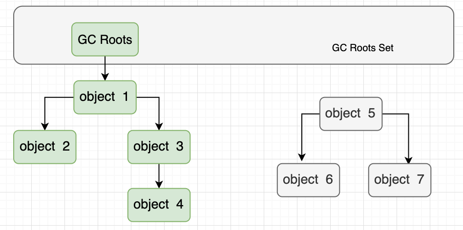

# 垃圾收集
垃圾自动收集是Java语言的一大优势点，JVM可以自动帮助程序员分配，释放内存，无需程序员自行对内存进行管理。

因为虚拟机栈、本地方法栈与程序计数器都是线程独享的部分，生命周期随着线程的死亡而自然被回收掉，但是堆内存和方法区是线程共享的，垃圾回收器就是需要关注这部分的内存。

那么到底什么样的对象是需要被当做垃圾收集，什么时候去收集呢？

## 如何判断一个对象需要被回收

### 回收算法
判断对象是否需要被回收主要有两种方法：

* 引用计数器计算：给对象添加一个引用计数器，每次引用这个对象时计数器加一，引用失效时减一，计数器等于0时就是不会再次使用的。不过这个方法有一种情况就是出现对象的循环引用时GC没法回收。
* 可达性分析计算：这是一种类似于二叉树的实现，将一系列的GC ROOTS作为起始的存活对象集，从这个节点往下搜索，搜索所走过的路径成为引用链，把能被该集合引用到的对象加入到集合中。搜索当一个对象到GC Roots没有使用任何引用链时，则说明该对象是不可用的。主流的商用程序语言，例如Java，C#等都是靠这招去判定对象是否存活的。

  **可达性分析演示图**：
  

  可作为GC ROOTS对象的有如下几种：
  * Java虚拟机栈中被引用的对象，各个线程调用的参数、局部变量、临时变量等。
  * 方法区中类静态属性引用的对象，比如引用类型的静态变量。
  * 方法区中常量引用的对象。
  * 本地方法栈中所引用的对象。
  * Java虚拟机内部的引用，基本数据类型对应的Class对象，一些常驻的异常对象。
  * 被同步锁（synchronized）持有的对象。

### 对象拯救
当一个对象被可达性分析后标记为回收对象后，不一定会被回收，因为要真正宣告一个对象的死亡，至少需要两次标记。
如果对象在可达性分析之后没有发现与GC Roots相连接的引用链，那它将会被第一次标记并执行一次筛选，筛选的条件是此对象是否有必须要执行的finalize方法。当对象
* 没有重写finalize对法
* finalize方法已经被虚拟机调用过

虚拟机将以上两种情况视为”没有必要执行finalize“，之后会回收它们。

如果这个对象被判定为有必要执行finalize方法，这个对象就会被放置在一个叫F-Queue的队列之中，并在稍后会由虚拟机自动创建一个低优先级的Finalizer线程去执行它。

这个线程执行只会触发这个方法，并不一定会等它运行结束，这样做的原因是：防止因为一个对象在finalze方法中执行缓慢或死循环，而导致F-Queue队列中其他对象处于永久等待状态，甚至导致整个内存回收系统崩溃。

finalize方法是对象逃脱死亡命运的最后一次机会，稍后GC将会对F-Queue队列中的对象进行第二次小规模的标记，如果对象在finalize方法中重新与引用链上的任何一个对象建立联系，就可以拯救自己。如：把自己（this关键字）赋值给某个类变量或者对象的成员变量，那在第二次标记时，它将被移除”即将回收“的集合。否则，基本上它就被真正回收了。

**finalize方法**：

finalize()是Object类的一个方法、一个对象的finalize()方法只会被系统自动调用一次，经过finalize()方法逃脱死亡的对象，第二次不会再调用。

补充一句：并不提倡在程序中调用finalize()来进行自救。建议忘掉Java程序中该方法的存在。因为它执行的时间不确定，甚至是否被执行也不确定（Java程序的不正常退出），而且运行代价高昂，无法保证各个对象的调用顺序（甚至有不同线程中调用）。在Java9中已经被标记为 deprecated ，且java.lang.ref.Cleaner（也就是强、软、弱、幻象引用的那一套）中已经逐步替换掉它，会比finalize来的更加的轻量及可靠。

## 参考资料
1. [大白话带你认识JVM](https://juejin.im/post/6844904048013869064#heading-2)
2. [别再说自己不会JVM了，看完这篇能和面试官扯上半小时](https://juejin.im/post/6856958647445291021#heading-1)