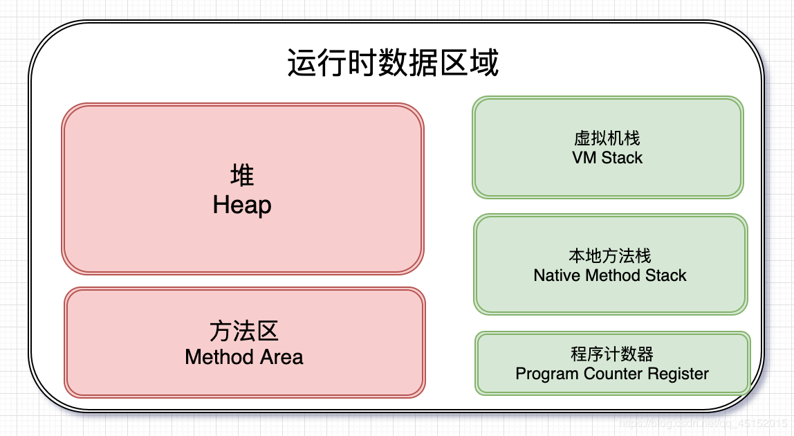
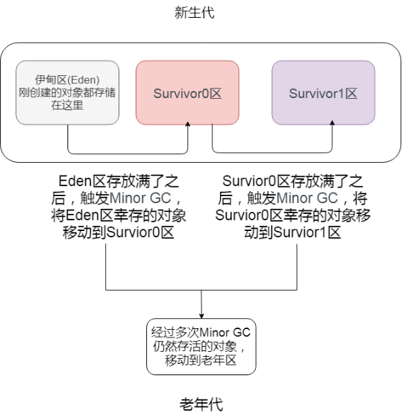

# 运行时数据区

## 介绍
Java程序在运行时，会为JVM单独划出一块内存区域，而这块内存区域又可以再次划分出一块运行时数据区，运行时数据区域大致可以分为五个部分：

图中红色代表共享区域，绿色代表线程私有区域，接下来分别介绍以上5个区域。

## 堆-共享
堆内存是用来存储对象的区域，分为年轻代和老年代，大致具有以下特征：
* 存储的是我们new来的对象，不存放基本类型和对象引用。
* 由于创建了大量的对象，垃圾回收器主要工作在这块区域。
* 线程共享区域，因此是线程不安全的。
* 能够发生内存溢出，抛出OutOfMemoryError。

堆内存内部划分如下：

### GC垃圾回收分类
在介绍堆内存的时候，不得不提到的肯定是GC的垃圾回收，GC垃圾回收分为以下几种：
* Minor GC/Young GC：针对新生代的垃圾收集。
* Major GC/Old GC：针对老年代的垃圾收集。
* Full GC：针对整个Java堆以及方法区的垃圾收集。

### 年轻代
年轻代是用来存储一些创建时间较短经历过较少次GC的对象，内部分为**Eden**和2个**Survivor**区。2个Survivor区也会分为**FromPlace**和**ToPlace**，ToPlace的survivor区域总是空的（为了在GC时使用标记-复制算法收集垃圾）。Eden，FromPlace和ToPlace的默认占比为 8:1:1。

年轻代中内存使用的方式大致如下：
1. 初创的对象会被存放到Eden区。
2. 当触发第一次Minor GC时，Eden区存活的对象被转移到FromPlace的survivor区。
3. 当下一次触发Minor GC时，Eden区与FromPlace的survivor区存活的对象被一起转移至ToPlace的survivor区，并交换from和to的指针，FromPlace转换为ToPlace,ToPlace变为FromPlace。
4. 当经历多次GC后仍然存活的对象（默认是经历15次GC，因为HotSpot会在对象投中的标记字段里记录年龄，分配到的空间仅有4位，所以最多只能记录到15），则会被从年轻代移动到老年代。

注意：当给大对象分配内存的时候，Eden区已经没有足够的内存空间了，这时候大对象会直接进入老年代。

### 老年代
老年代中存储的都是长期存活的对象，这块区域不会频繁的触发GC。当老年代占满的时候会触发Full GC，期间会停止所有线程等待GC的完成。所以对于响应要求高的应用应该尽量去减少发生Full GC从而避免响应超时的问题。

而且当老年区执行了Full GC之后仍然无法进行对象保存的操作，就会产生OOM，这时候就是虚拟机中的堆内存不足，原因可能会是堆内存设置的大小过小，也可能是代码中创建的对象大且多，而且它们一直在被引用从而长时间垃圾收集无法收集它们。

## 方法区-共享
方法区是用于存放类似于元数据信息方面的数据的，主要特点如下：
* 线程共享区域，因此这是线程不安全的区域。
* 方法区也是一个可能会发生OutOfMemoryError的区域。
* 方法区存储的是从Class文件加载进来的静态变量、类信息、常量池以及编译器编译后的代码。

方法区是Java虚拟机规范中的定义，是一种规范。在Java8以前它的实现是永久代，在Java8以后元空间取代了永久代。

## 虚拟机栈-独享
虚拟机栈是我们代码运行的空间，我们的所有方法都会在栈中运行，是Java方法执行的内存模型。主要特点如下：

* 线程私有区域，每一个线程都有独享一个虚拟机栈，因此这是线程安全的区域。
* 存放基本数据类型以及对象的引用。8种基本类型的变量+对象的引用变量+实例方法都是在栈里面分配内存。
* 栈中的数据都是以栈帧的格式存在，它是一个关于方法和运行期数据的数据集。每个方法执行的时候都会在虚拟机栈中创建一个相应栈帧，方法执行完毕后该栈帧就会被销毁。方法栈帧是以先进后出的方式。
* 每一个栈帧又可以划分为局部变量表、操作数栈、动态链接、方法出口以及额外的附加信息。
* 这个区域可能有两种异常：
  * StackOverflowError：如果线程请求的栈深度大于虚拟机所允许的深度，将抛出StackOverflowError异常（通常是递归导致的）。
  * OutOfMemoryError：JVM动态扩展时无法申请到足够内存则抛出OutOfMemoryError异常。
* 虚拟机栈中不存在垃圾回收，只要程序运行结束栈的空间就会释放。栈的生命周期与所在的线程一致。

## 本地方法栈-独享
本地方法栈与Java虚拟机栈类似，唯一的不同在于本地方法栈是Java程序在调用本地方法的时候创建栈帧的地方。本地方法栈的底层是使用C来进行工作的，和Java没有太大的关系，但是它同样会抛出StackOverflowError和OutOfMemoryError。

## 程序计数器-独享
程序计数器与栈一样，是线程私有的，不存在线程安全问题。它是用来记录下一行我们需要执行的代码，类似一个指针一样。当我们的线程在被抢走CPU执行时间片以后，再重新抢到时间片的时候，会依照程序计数器指向的位置继续执行。

## 参考资料
1. [大白话带你认识JVM](https://juejin.im/post/6844904048013869064#heading-2)
2. [别再说自己不会JVM了，看完这篇能和面试官扯上半小时](https://juejin.im/post/6856958647445291021#heading-1)