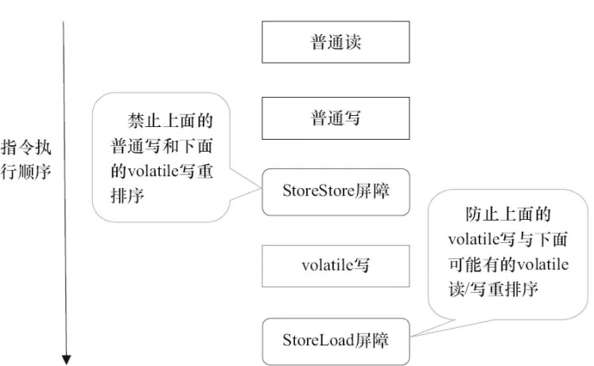
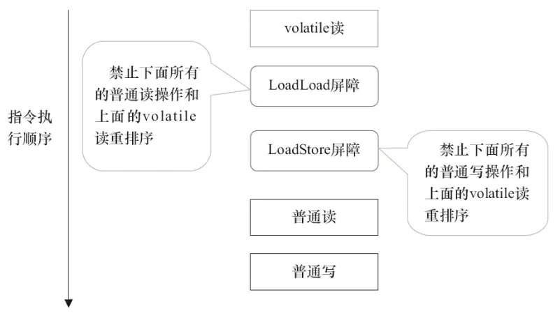

# 多线程原理

## 并发编程的两种模型
并发编程主要面临两个问题：

* 线程间如何通信？即：线程之间以何种机制来交换信息
* 线程间如何同步？即：线程以何种机制来控制不同线程间操作发生的相对顺序

解决这两个问题的并发模型有两个，分别是消息传递并发模型与共享内存并发模型，Java使用的是第二个模型。

### 消息传递并发模型
通信： 线程之间没有公共状态，使用发送消息的形式来显式的进行线程间通信。

同步： 发送消息往往发生在接收到消息之后，所以天然隐式同步。（我理解是类似于消息机制，在另一线程收到消息之前不会有操作，收到消息以后再进行操作的话这样已经是同步了）

### 共享内存并发模型
通信： 通过共享程序之间的公共状态，读写内存中的公共状态来达到通信的目的。

同步： 通过指定代码段互斥执行来达到控制线程执行顺序，达到同步。

## Java内存模型抽象结构

### 运行时内存划分
内存抽象结构图：


如上，Java内存结构主要分为2块：堆和栈。栈中的数据都是私有的，不与其他线程共享，不存在内存可见性的问题。而堆中的数据存放的都是共享变量，需要与其他的线程共享，内存可见性是针对于共享变量的。

### 内存不可见缘由
因为现代计算机的设计，为了保证速度，往往会在高速缓存区中缓存共享变量，因为cpu访问缓存区比访问内存要快得多。所以每个线程都有一个抽象的本地内存，本地内存是私有的，其他线程不可见，本地内存会将使用到的共享变量从主内存中缓存至本地内存，然后再读取使用，如果更改了则需要将本地内存更新至主内存中。这样就导致了内存不可见问题，线程不可访问互相的本地内存。
注意，根据JMM(Java内存模型)的规定，线程对共享变量的所有操作都必须在自己的本地内存中进行，不能直接从主内存中读取。

所以线程B并不是直接去主内存中读取共享变量的值，而是先在本地内存B中找到这个共享变量，发现这个共享变量已经被更新了，然后本地内存B去主内存中读取这个共享变量的新值，并拷贝到本地内存B中，最后线程B再读取本地内存B中的新值。

那么怎么知道这个共享变量的被其他线程更新了呢？这就是JMM的功劳了，也是JMM存在的必要性之一。JMM通过控制主内存与每个线程的本地内存之间的交互，来提供内存可见性保证。

### JMM与Java内存区域划分的区别与联系
* 区别

两者是不同的概念层次。JMM是抽象的，他是用来描述一组规则，通过这个规则来控制各个变量的访问方式，围绕原子性、有序性、可见性等展开的。而Java运行时内存的划分是具体的，是JVM运行Java程序时，必要的内存划分。

* 联系

都存在私有数据区域和共享数据区域。一般来说，JMM中的主内存属于共享数据区域，他是包含了堆和方法区；同样，JMM中的本地内存属于私有数据区域，包含了程序计数器、本地方法栈、虚拟机栈。

## 指令重排序
指令重排序简单来说是为了提高CPU执行性能而对程序指令做出的重新排序执行的一个过程，会导致程序语句乱序但是提升执行性能。

一般分为以下三种：
* 编译器优化重排
编译器在不改变单线程程序语义的前提下，可以重新安排语句的执行顺序。

* 指令并行重排
现代处理器采用了指令级并行技术来将多条指令重叠执行。如果不存在数据依赖性(即后一个执行的语句无需依赖前面执行的语句的结果)，处理器可以改变语句对应的机器指令的执行顺序。

* 内存系统重排
由于处理器使用缓存和读写缓存冲区，这使得加载(load)和存储(store)操作看上去可能是在乱序执行，因为三级缓存的存在，导致内存与缓存的数据同步存在时间差。

指令重排可以保证串行语义一致，但是不保证多线程间的语义也一致。

## 什么是happens-before
我理解的happens-before就是JMM(Java内存模型)制定的一个规则，就是说如果两个操作符合A happens-before B，那么这个操作就要具有happens-before的特性：

1. 如果一个操作happens-before另一个操作，那么第一个操作的执行结果将对第二个操作可见，而且第一个操作的执行顺序排在第二个操作之前。
2. 两个操作之间存在happens-before关系，并不意味着Java平台的具体实现必须要按照happens-before关系指定的顺序来执行。如果重排序之后的执行结果，与按happens-before关系来执行的结果一致，那么JMM也允许这样的重排序。

这个规则定制的意义在于程序员可以简单的定义，如果A happens-before B 那么程序执行的结果一定符合我们的顺序预期。程序员只要遵循happens-before原则，就能保证执行结果。JMM同时允许编译器与处理器对指令去做重排序，只要重排序以后的结果要与未重排序的结果一致，否则则禁止重排序。这样可以提供强内存可见性的保证，同时减少对编译器与处理器的束缚，允许他们最大化的优化性能。

## volatile

### 语义
* 保证变量的内存可见性
* 禁止volatile变量与普通变量重排序（JSR133提出，Java 5 开始才有这个“增强的volatile内存语义”）

volatile修饰的变量可以确保在写入以后马上更新至主存，并且让其他线程本地内存的变量失效，确保可见性，同时通过内存屏障来达到禁止重排序的功能。

### 如何禁止CPU指令重排序
因为volatile修饰词可以禁止指令重排序，编译器部分比较好处理，但是如何禁止CPU的指令重排序呢？这个时候使用到的就是**内存屏障**了，编译器会在编译成字节码时在指令序列中插入内存屏障来禁止特定类型的处理器重排序。

那么到底什么是内存屏障呢？

在硬件层面，内存屏障分两种：读屏障（Load Barrier）和写屏障（Store Barrier）。内存屏障有两个作用：

* 阻止屏障两侧的指令重排序；
* 强制把写缓冲区/高速缓存中的脏数据等写回主内存，或者让缓存中相应的数据失效。

JMM什么时候会插入内存屏障呢？

编译器选择了一个比较保守的JMM内存屏障插入策略，这样可以保证在任何处理器平台，任何程序中都能得到正确的volatile内存语义。这个策略是：

* 在每个volatile写操作前插入一个StoreStore屏障；
* 在每个volatile写操作后插入一个StoreLoad屏障；
* 在每个volatile读操作后插入一个LoadLoad屏障；
* 在每个volatile读操作后再插入一个LoadStore屏障。

这些屏障分别代表的意思是：
* StoreStore屏障：禁止上面的普通写和下面的volatile写重排序；
* StoreLoad屏障：防止上面的volatile写与下面可能有的volatile读/写重排序
* LoadLoad屏障：禁止下面所有的普通读操作和上面的volatile读重排序
* LoadStore屏障：禁止下面所有的普通写操作和上面的volatile读重排序

volatile写插入内存屏障示意图:


volatile读插入内存屏障示意图:



总结一下即是：
* volatile写本身与前面的普通写与之后的volatile读/写都不可重排序；
* volatile读本身与之后的普通读写都不可重排序；

### 总结
在保证内存可见性这一点上，volatile有着与锁相同的内存语义，所以可以作为一个“轻量级”的锁来使用。但由于volatile仅仅保证对单个volatile变量的读/写具有原子性，而锁可以保证整个临界区代码的执行具有原子性。所以在功能上，锁比volatile更强大；在性能上，volatile更有优势。

### 注意点
volatile关键词是为了保证变量的可见性与有序性而存在的，并不能保证操作的原子性。在Java中，只有基础类型变量的复制是原子操作，比如`int i = 1;`。但是像`i++;`以及`j = i;`这种操作是不保证原子性的。

举例：
```JAVA
public volatile int i = 100;

i++;
```
以上代码`i++;`可以分解成3个操作：
1. 读取主内存中的值
2. 读取本地内存中的i，并自增
3. 回写值至主内存中

如果同时有2个线程同时执行以上操作，当线程1执行了step1但是在执行step2的时候阻塞了，并没有继续执行，这个时候线程2开始执行step1，读取到100，因为线程1并没有执行step2，并未修改i的值，然后线程2执行step2,step3,至此由可见性原则，其他所有的线程都可见这个新值，但是线程1已经完成了读取操作，并不需要再次执行读取操作，此刻用来自增的值还是100，然后执行完step2后执行step3刷入主存，至此操作出现错误。(网上有关于为何线程2修改以后没有把线程1中的缓存值失效然后再重新读取的讨论，结论就是修改以后确实会让线程1的缓存失效，但是值已经读取过了，进入了寄存器计算的流程，寄存器中的值并不会失效)

所以volatile是不保证原子性的，在多线程的情况下还是需要使用同步代码块加锁或CAS的操作来保证不会被多线程影响结果。

总结一句话： **不要将volatile用在getAndOperate场合，仅仅set或者get的场景是适合volatile的**。

## synchronized与锁

### 锁
Java中的锁都是基于对象的，即使是类锁，使用的也是类的class对象，Java中所有的对象都可以当作锁来使用。

### synchronized关键词
* synchronized是我们常用的用来给指定代码块或方法加锁的关键词；
* synchronized关键词可以用来修饰方法，静态方法与代码块，synchronized修饰的部分则为临界区；
* synchronized关键词修饰普通方法时，锁使用的当前实例，修饰于静态代码块时使用的则是类对象；

### 临界区
临界区的定义是指某一块代码区域在同一时间只能被一个线程所执行

### 锁的分类
* 偏向锁状态：偏向于第一个访问锁的线程，如果没有其他线程竞争，则不会触发同步机制，提高了程序的运行性能；
* 轻量级锁状态：采用CAS自旋方式方式竞争锁，如果一直能够在失败次数以内正常获取到锁，则保持轻量级锁，提高同步执行速度；
* 重量级锁状态：基于互斥量（mutex）实现，采用阻塞-唤醒的方式来获取锁，当没获取到锁的时候阻塞自己，等待其他线程来唤醒，效率低响应速度慢；

### 锁的信息存放位置
锁信息是存放于对象的对象头中，Java每个对象都有一个对象头，如果是非数组类型，会有2个字宽来存储，而数组类型则会使用3个字宽在存储。在32位处理器中，一个字宽是32位；在64位虚拟机中，一个字宽是64位。对象头的内容如下：

长度 | 内容 | 说明
---|---|---
32/64bit | Mark Word | 存储对象的hashCode或者锁信息
32/64bit | Class Metadadata Address | 存储到对象类型数据的指针
32/64bit | Array length | 数组的长度（如果是数组）
**ps.只需关注Mark Word**

### 锁的升级机制
1. 检查锁对象的Mark Word中放的是不是自己线程的线程id，如果是的话，表示当前的锁为偏向锁，可以直接拿到偏向锁执行
2. 如果Mark Word中不是自己的线程id，尝试使用CAS来替换锁对象的Mark Word为自己的线程id，如果替换成功则锁不升级，失败则升级锁为轻量级锁，通过Mark Word中的线程id通知线程暂停，之前的线程清除偏向锁标识
3. 两个线程将锁对象的HashCode复制到自己新建的用于存储锁记录的空间，然后通过使用CAS将Mark Word空间写入指向自己存储锁记录空间的方式来竞争锁
4. 第三步中竞争成功的锁进入执行，失败的锁则进入自旋，自旋有失败次数限制，Java使用自旋自适应，白话就是自旋成功次数越多则尝试次数越多，反之则越少。
5. 如果在自旋超过最大次数限制之前获取到了锁，则依旧是轻量级锁，反之则进行锁升级，变成重量级锁
6. 到了重量级锁状态，之前自旋的锁进入阻塞状态，不占用cpu资源，等待之前执行的线程来唤醒自己

### 锁的优缺点与适用场景

锁 | 优点 | 缺点 | 适用场景
---|---|---|---
偏向锁 | 加锁解锁不需要额外的消耗，和执行非同步方法相比仅存纳秒级的区别 | 如果线程间存在锁竞争则会存在锁撤销的开销 | 适用于只有一个线程的场景
轻量级锁 | 竞争的锁不会阻塞，提高了响应速度 | 得不到锁的线程会自旋一直消耗cpu | 追求响应时间，同步执行速度很快
重量级锁 | 竞争的锁会阻塞，不会消耗cpu | 线程阻塞，响应速度慢 | 追求吞吐量，同步执行消耗时间长

## 乐观锁和悲观锁
* 悲观锁：指以悲观的观念看待每次执行临界区代码，每次执行都认为必然有线程会进行竞争，必须加锁来保证临界区在同一时间只有一个线程执行，多用于写多读少的场景，避免因为频繁失败与重试造成性能消耗
* 乐观锁：乐观锁刚好与之相反，认为每次执行临界区代码都没有线程竞争，对共享资源的访问总是没有冲突的，所以不需要加锁，被称“无锁”，使用CAS机制保证线程执行的安全性。因为乐观锁无锁的特点，天然不存在死锁的情况不需要考虑死锁的情况，适用于读多写少的情况。

## CAS
### 定义
CAS的全称比较并交换（compare and swap）。在CAS中有三个值：
1. V：要更新的变量值（var）
2. E：期待的原值（expected）
3. N：用来替换的新值（new）

比较并交换的操作为：比较V与E是否一致，如果一致则替换，不一致则放弃操作。

因为CAS是系统原语，是原子性的操作，所以不会存在替换的时候值已经更换的情况，且多个线程进行CAS一个变量的时候，必然只有一个线程会成功，其余均会失败，失败的线程不会被挂起，只是被告知失败，系统允许其他线程重试CAS操作，也允许放弃。

### Java实现CAS的原理--Unsafe类
Java中有个Unsafe类，其中有几个关于CAS的类，都是用native关键词修饰，交由底层JVM使用C++实现：
```
boolean compareAndSwapObject(Object o, long offset,Object expected, Object x);
boolean compareAndSwapInt(Object o, long offset,int expected,int x);
boolean compareAndSwapLong(Object o, long offset,long expected,long x);
```
Java在`java.util.concurrent.atomic`包下提供了很多原子性操作的类，内部原理则是使用了do while循环并调用了Unsafe类中的CAS方法，确保不使用锁的情况下以原子性的操作来不停地修改变量直至成功，并获取到修改后的值。

### CAS三大问题
* ABA问题：即一个值从A->B->A，这个时候CAS是检测不出来变化的，解决方案就是加上版本号或者时间戳，从JDK1.5开始，JAK提供了`AtomicStampedReference`类来解决这个问题，只有当引用和标志都相等的时候，才使用CAS设置为新的值和标志
* 循环时间长开销大：CAS多与自旋结合。如果自旋CAS长时间不成功，会占用大量的CPU资源。解决思路是让JVM支持处理器提供的pause指令。pause指令能让自旋失败时cpu睡眠一小段时间再继续自旋，从而使得读操作的频率低很多,为解决内存顺序冲突而导致的CPU流水线重排的代价也会小很多
* 只能保证一个共享变量的原子操作
  1. 使用JDK 1.5开始就提供的AtomicReference类保证对象之间的原子性，把多个变量放到一个对象里面进行CAS操作
  2. 使用锁。锁内的临界区代码可以保证只有当前线程能操作


## AQS

### 定义
AQS即抽象队列同步器，指抽象的实现了一些必要的核心方法，其他方法由子类实现的一个队列存储的同步器，使用AQS可以很简单的构建一个同步器。

### 原理
AQS中保存了一个使用volatile修饰的state变量，用来表示当前获取到资源的状态，还有一个保存当前加锁线程的变量，还有一个先进先出的队列，用来保存加锁失败的等待队列。加锁流程如下：

1. state变量初始值为0，线程1使用CAS尝试修改state变量，若成功则修改state为1，设置加锁线程为线程1
2. 线程2尝试加锁，使用CAS修改state，但state不为0，修改失败，使用CAS将自己写入等待队列，写入成功后进入阻塞
3. 线程1释放锁，将state从1改为0，并设置加锁线程为null，并唤醒等待队列的头部线程2
4. 线程2尝试加锁，重复线程1的步骤

AQS资源共享还分为独占模式和共享模式：
* 独占模式（Exclusive）：资源是独占的，一次只能一个线程获取。如ReentrantLock。
* 共享模式（Share）：同时可以被多个线程获取，具体的资源个数可以通过参数指定。如Semaphore/CountDownLatch。

### AQS相关实现
#### Semaphore 信号量
信号量是一个允许多个线程同时获取资源的共享式锁，在初始化的时候就定义信号总数，在需要加锁的地方申请信号量，如果拿到了则获取资源，在使用完了以后可以释放资源，供其他线程获取。

Semaphore默认的acquire方法是会让线程进入等待队列，且会抛出中断异常。但它还有一些方法可以忽略中断或不进入阻塞队列。
```JAVA
public class SemaphoreExample1 {
  // 请求的数量
  private static final int threadCount = 550;

  public static void main(String[] args) throws InterruptedException {
    // 创建一个具有固定线程数量的线程池对象（如果这里线程池的线程数量给太少的话你会发现执行的很慢）
    ExecutorService threadPool = Executors.newFixedThreadPool(300);
    // 一次只能允许执行的线程数量。
    final Semaphore semaphore = new Semaphore(20);

    for (int i = 0; i < threadCount; i++) {
      final int threadnum = i;
      threadPool.execute(() -> {// Lambda 表达式的运用
        try {
          semaphore.acquire();// 获取一个许可，所以可运行线程数量为20/1=20
          test(threadnum);
          semaphore.release();// 释放一个许可
        } catch (InterruptedException e) {
          // TODO Auto-generated catch block
          e.printStackTrace();
        }

      });
    }
    threadPool.shutdown();
    System.out.println("finish");
  }

  public static void test(int threadnum) throws InterruptedException {
    Thread.sleep(1000);// 模拟请求的耗时操作
    System.out.println("threadnum:" + threadnum);
    Thread.sleep(1000);// 模拟请求的耗时操作
  }
}
```

#### CountDownLatch （倒计时器）
CountDownLatch是用于指定的当多个线程都完成任务以后，才可以获取到倒计时器锁住的资源。在初始化的时候定义需要等待的线程数量，然后每个线程执行完毕以后调用`countDown`方法，计数器就会减一，直至减至0，则锁释放。
```JAVA
public class CountDownLatchExample1 {
  // 请求的数量
  private static final int threadCount = 550;

  public static void main(String[] args) throws InterruptedException {
    // 创建一个具有固定线程数量的线程池对象（如果这里线程池的线程数量给太少的话你会发现执行的很慢）
    ExecutorService threadPool = Executors.newFixedThreadPool(300);
    final CountDownLatch countDownLatch = new CountDownLatch(threadCount);
    for (int i = 0; i < threadCount; i++) {
      final int threadnum = i;
      threadPool.execute(() -> {// Lambda 表达式的运用
        try {
          test(threadnum);
        } catch (InterruptedException e) {
          // TODO Auto-generated catch block
          e.printStackTrace();
        } finally {
          countDownLatch.countDown();// 表示一个请求已经被完成
        }

      });
    }
    countDownLatch.await();
    threadPool.shutdown();
    System.out.println("finish");
  }

  public static void test(int threadnum) throws InterruptedException {
    Thread.sleep(1000);// 模拟请求的耗时操作
    System.out.println("threadnum:" + threadnum);
    Thread.sleep(1000);// 模拟请求的耗时操作
  }
}
```

如果在参与者（线程）在等待的过程中，Barrier被破坏，就会抛出BrokenBarrierException。可以用isBroken()方法检测Barrier是否被破坏。

* 如果有线程已经处于等待状态，调用reset方法会导致已经在等待的线程出现BrokenBarrierException异常。并且由于出现了BrokenBarrierException，将会导致始终无法等待。
* 如果在等待的过程中，线程被中断，也会抛出BrokenBarrierException异常，并且这个异常会传播到其他所有的线程。
* 如果在执行屏障操作过程中发生异常，则该异常将传播到当前线程中，其他线程会抛出BrokenBarrierException，屏障被损坏。
* 如果超出指定的等待时间，当前线程会抛出 TimeoutException 异常，其他线程会抛出BrokenBarrierException异常。

#### CyclicBarrier(循环栅栏)
CyclicBarrier和CountDownLatch有些相似，循环栅栏也是定义等待的线程数，当与指定的线程数相等的线程到达以后，锁开，允许执行，然后会重置栅栏，继续等待下次线程冲开栅栏。
```JAVA
public class CyclicBarrierExample2 {
  // 请求的数量
  private static final int threadCount = 550;
  // 需要同步的线程数量
  private static final CyclicBarrier cyclicBarrier = new CyclicBarrier(5);

  public static void main(String[] args) throws InterruptedException {
    // 创建线程池
    ExecutorService threadPool = Executors.newFixedThreadPool(10);

    for (int i = 0; i < threadCount; i++) {
      final int threadNum = i;
      Thread.sleep(1000);
      threadPool.execute(() -> {
        try {
          test(threadNum);
        } catch (InterruptedException e) {
          // TODO Auto-generated catch block
          e.printStackTrace();
        } catch (BrokenBarrierException e) {
          // TODO Auto-generated catch block
          e.printStackTrace();
        }
      });
    }
    threadPool.shutdown();
  }

  public static void test(int threadnum) throws InterruptedException, BrokenBarrierException {
    System.out.println("threadnum:" + threadnum + "is ready");
    try {
      /**等待60秒，保证子线程完全执行结束*/
      cyclicBarrier.await(60, TimeUnit.SECONDS);
    } catch (Exception e) {
      System.out.println("-----CyclicBarrierException------");
    }
    System.out.println("threadnum:" + threadnum + "is finish");
  }

}
```

### CyclicBarrier与CountDownLatch的区别
CountDownLatch中的计数器是递减且不会重置的，核心在于其他线程完成了countDown以后可以继续执行自己的其他任务，也可以结束，而CyclicBarrier的核心在于所有的线程执行到我等待的地方的时候，都必须等待着，只要有一个线程未执行完毕，你都得等待着，直到全部线程都执行完毕，然后统一通过

## 参考资料
1. [Java多线程原理篇](http://concurrent.redspider.group/article/02/6.html)
2. [让你彻底理解volatile](https://www.jianshu.com/p/157279e6efdb)
3. [volatile为什么不能保证原子性？](https://www.zhihu.com/question/329746124)