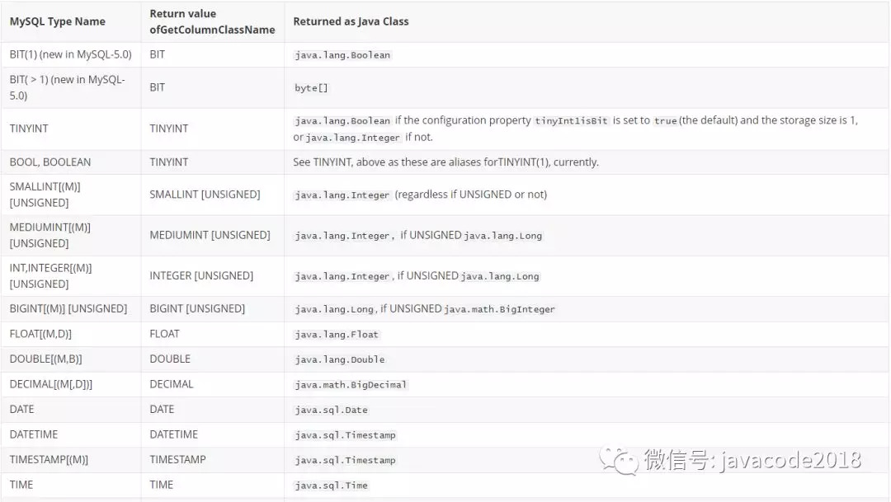

# 数据类型

## MySQL数据类型列表
分类 | 类型名称 | 字节数 | 说明
---|---|---| -- |
整数类型 | tinyInt | 1 | 很小的整数(8位二进制)
- | smallint | 2 | 小的整数(16位二进制)
- | mediumint | 3 | 中等大小的整数(24位二进制)
- | int(integer) | 4 | 普通大小的整数(32位二进制)
- | bigint | 8 | 普通大小的整数(64位二进制)
小数类型 | float | 4 | 单精度浮点数
- | double | 8 | 双精度浮点数
- | decimal(m,d) | 依赖M与D的值 | 压缩严格的定点数
日期类型 | year | 1 | YYYY 1901~2155
- | time | 3 | HH:MM:SS -838:59:59~838:59:59
- | date | 3 | YYYY-MM-DD 1000-01-01~9999-12-3
- | datetime | 8 | YYYY-MM-DD HH:MM:SS 1000-01-01 00:00:00~ 9999-12-31 23:59:59
- | timestamp | 4 | YYYY-MM-DD HH:MM:SS 19700101 00:00:01 UTC~2038-01-19 03:14:07UTC
文本、二进制类型 | CHAR(M) | M | M为0~255之间的整数
- | VARCHAR(M) | M | M为0~65535之间的整数
- | TINYBLOB | L + 1 | 允许长度0~255字节
- | BLOB | L + 2 | 允许长度0~65535字节
- | MEDIUMBLOB | L + 3 | 允许长度0~167772150字节
- | LONGBLOB | L + 4 | 允许长度0~4294967295字节
- | TINYTEXT | L + 1 | 允许长度0~255字节
- | TEXT | L + 2 | 允许长度0~65535字节
- | MEDIUMTEXT | L + 3 | 允许长度0~167772150字节
- | LONGTEXT | L + 4 | 允许长度0~4294967295字节
- | VARBINARY(M) | M | 允许长度0~M个字节的变长字节字符串
- | BINARY(M) | M | 允许长度0~M个字节的定长字节字符串
(L指存储的数据本身占用的字节，L以外所需的额外字节为存放该值的长度所需的字节数)

## 类型特点

### 整数类型
整数类型可以被指定长度，例如：INT(11)表示长度为11的INT类型。长度在大多数场景是没有意义的，它不会限制值的合法范围，只会影响显示字符的个数，而且需要和
UNSIGNED ZEROFILL属性配合使用才有意义。

比如假定类型设定为INT(5)，属性为UNSIGNED ZEROFILL，如果用户插入的数据为12的话，那么数据库实际存储数据为00012。

### 浮点类型
* float和double都是浮点型，而decimal是定点型
* 浮点型和定点型可以用类型名称后加（M，D）来表示，M表示该值的总共长度，D表示小数点后面的长度，M和D又称为精度和标度。
* float和double在不指定精度时，默认会按照实际的精度来显示，而DECIMAL在不指定精度时，默认整数为10，小数为0。
* DECIMAL可以用于存储比BIGINT还大的整型，能存储精确的小数。
* FLOAT和DOUBLE是有取值范围的，并支持使用标准的浮点进行近似计算。
* 计算时FLOAT和DOUBLE相比DECIMAL效率更高一些，DECIMAL你可以理解成是用字符串进行处理。

> 注意： decimal采用的是四舍五入，float和double采用的是四舍六入五成双。
>
> 四舍六入五成双：就是5以下舍弃5以上进位，如果需要处理数字为5的时候，需要看5后面是否还有不为0的任何数字，如果有，则直接进位，如果没有，需要看5前面的数字，若是奇数则进位，若是偶数则将5舍掉

### 字符类型
* VARCHAR用于存储可变长字符串，它比定长类型更节省空间。
* VARCHAR使用额外1或2个字节存储字符串长度。列长度小于255字节时，使用1字节表示，否则使用2字节表示。
* VARCHAR存储的内容超出设置的长度时，内容会被截断。
* CHAR是定长的，根据定义的字符串长度分配足够的空间。
* CHAR会根据需要使用空格进行填充方便比较。
* CHAR适合存储很短的字符串，或者所有值都接近同一个长度。 
* CHAR存储的内容超出设置的长度时，内容同样会被截断。

### 枚举类型（ENUM）
* 枚举把不重复的数据存储为一个预定义的集合，有时可以使用ENUM代替常用的字符串类型。
* ENUM存储非常紧凑，会把列表值压缩到一个或两个字节。
* ENUM在内部存储时，其实存的是整数。
* 尽量避免使用数字作为ENUM枚举的常量，因为容易混乱。
* 排序是按照内部存储的整数

### 日期类型
* 尽量使用timestamp，空间效率高于datetime，
* 用整数保存时间戳通常不方便处理。
* 如果需要存储微秒，可以使用bigint存储。

### Java-MySQL数据类型对比图

## 使用建议
* 选小不选大：一般情况下选择可以正确存储数据的最小数据类型，越小的数据类型通常更快，占用磁盘，内存和CPU缓存更小。
* 简单就好：简单的数据类型的操作通常需要更少的CPU周期，例如：整型比字符操作代价要小得多，因为字符集和校对规则(排序规则)使字符比整型比较更加复杂。
* 尽量避免NULL：尽量制定列为NOT NULL，除非真的需要NULL类型的值，有NULL的列值会使得索引、索引统计和值比较更加复杂。
* 浮点类型的建议统一选择decimal，float和double会出现丢失精度的问题。
* 记录时间的建议使用int或者bigint类型，将时间转换为时间戳格式，如将时间转换为秒、毫秒，进行存储，方便走索引
* 对于字符长度比较接近，长度差不多的字符串使用char存储
* 当字符串存储的长度大于5000时使用TEXT存储，并独立出一张表，用主键对应，避免影响其他字段索引效率。
* 字符串使用时要注意只分配需要的空间，更长的列排序时会消耗更多内存。

## 参考资料
1. [MySQL数据库面试题（2020最新版）](https://blog.csdn.net/ThinkWon/article/details/104778621)
2. [Mysql系列 - 第2天：详解mysql数据类型（重点）](https://mp.weixin.qq.com/s?__biz=MzA5MTkxMDQ4MQ%3D%3D&chksm=88621ba8bf1592beb2ef6106d6bf9f3eccd48d6814c7031f36e3c8be68821f17cf065129688c&idx=1&lang=zh_CN&mid=2648933270&scene=21&sn=409080e17352da2035b0bfdf63ccdfde&token=1876080189#wechat_redirect)