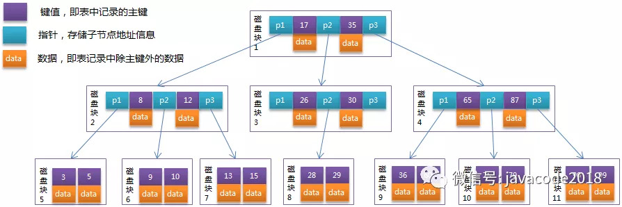
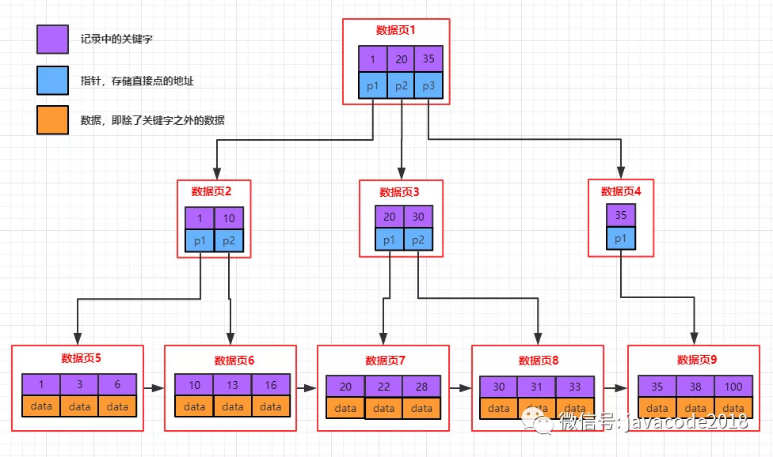
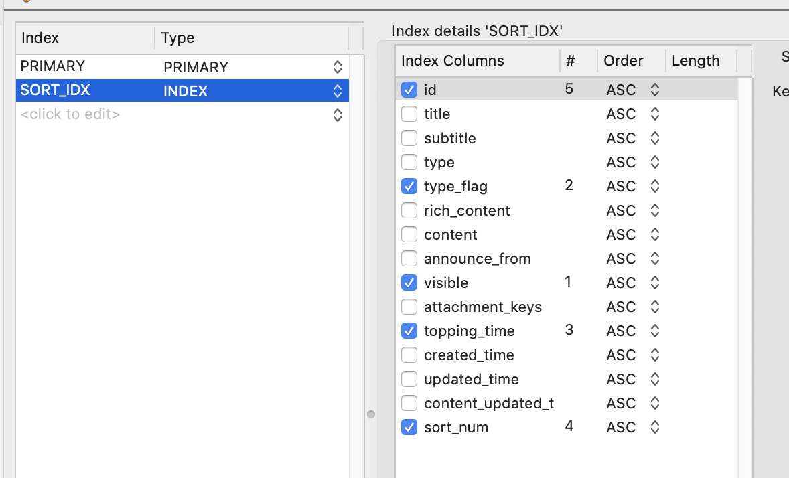

# 索引

## 什么是索引？
索引是一种特殊的文件(InnoDB数据表上的索引是表空间的一个组成部分)，它们包含着对数据表里所有记录的引用指针。

索引是一种数据结构。数据库索引，是数据库管理系统中一个排序的数据结构，以协助快速查询、更新数据库表中数据。索引的实现通常使用B树及其变种B+树。

更通俗的说，索引就相当于目录。为了方便查找书中的内容，通过对内容建立索引形成目录。索引是一个文件，它是要占据物理空间的

## 索引有哪些优缺点？
索引的优点

* 可以大大加快数据的检索速度，这也是创建索引的最主要的原因。
* 通过使用索引，可以在查询的过程中，使用优化隐藏器，提高系统的性能。

索引的缺点

* 时间方面：创建索引和维护索引要耗费时间，具体地，当对表中的数据进行增加、删除和修改的时候，索引也要动态的维护，会降低增/改/删的执行效率；
* 空间方面：索引需要占物理空间。

## 索引使用场景（重点）
### where


上图中，根据`id`查询记录，因为`id`字段仅建立了主键索引，因此此SQL执行可选的索引只有主键索引，如果有多个，最终会选一个较优的作为检索的依据。

### order by
当我们使用`order by`将查询结果按照某个字段排序时，如果该字段没有建立索引，那么执行计划会将查询出的所有数据使用外部排序（将数据从硬盘分批读取到内存使用内部排序，最后合并排序结果），这个操作是很影响性能的，因为需要将查询涉及到的所有数据从磁盘中读到内存（如果单条数据过大或者数据量过多都会降低效率），更无论读到内存之后的排序了。

但是如果我们对该字段建立索引`alter table 表名 add index(字段名)`，那么由于索引本身是有序的，因此直接按照索引的顺序和映射关系逐条取出数据即可。而且如果分页的，那么只用取出索引表某个范围内的索引对应的数据，而不用像上述那取出所有数据进行排序再返回某个范围内的数据。（从磁盘取数据是最影响性能的）

### join
对`join`语句匹配关系`on`涉及的字段建立索引能够提高效率

### 索引覆盖
如果要查询的字段都建立过索引，那么引擎会直接在索引表中查询而不会访问原始数据（否则只要有一个字段没有建立索引就会做全表扫描），这叫索引覆盖。因此我们需要尽可能的在select后只写必要的查询字段，以增加索引覆盖的几率。

这里值得注意的是不要想着为每个字段建立索引，因为优先使用索引的优势就在于其体积小。

## 索引有哪几种类型？
**主键索引**: 数据列不允许重复，不允许为NULL，一个表只能有一个主键。

**唯一索引**: 数据列不允许重复，允许为NULL值，一个表允许多个列创建唯一索引。

  * 可以通过 `ALTER TABLE table_name ADD UNIQUE (column);` 创建唯一索引

  * 可以通过 `ALTER TABLE table_name ADD UNIQUE (column1,column2);` 创建唯一组合索引

**普通索引**: 基本的索引类型，没有唯一性的限制，允许为NULL值。

  * 可以通过`ALTER TABLE table_name ADD INDEX index_name (column);`创建普通索引

  * 可以通过`ALTER TABLE table_name ADD INDEX index_name(column1, column2, column3);`创建组合索引

**全文索引**： 用关键字的匹配来进行查询过滤，基于相似度的查询，是目前搜索引擎使用的一种关键技术。

  * 可以通过`ALTER TABLE table_name ADD FULLTEXT (column);`创建全文索引

## 索引的基本原理
索引用来快速地寻找那些具有特定值的记录。如果没有索引，一般来说执行查询时遍历整张表。

索引的原理很简单，就是把无序的数据变成有序的查询：

1. 把创建了索引的列的内容进行排序
2. 对排序结果生成倒排表
3. 在倒排表内容上拼上数据地址链
4. 在查询的时候，先拿到倒排表内容，再取出数据地址链，从而拿到具体数据

## 索引设计的原则？
* 创建在适合的场景。
* 区分度较小的列无需索引。
* 使用短索引，长字符需指定一个前缀长度，这样能够节省大量索引空间。
* 不要过度索引。索引需要额外的磁盘空间，并降低写操作的性能。在修改表内容的时候，索引会进行更新甚至重构，索引列越多，这个时间就会越长。所以只保持需要的索引有利于查询即可。

## 创建索引的原则（重中之重）
* 最左前缀匹配原则，组合索引非常重要的原则，mysql会一直向右匹配直到遇到范围查询(>、<、between、like)就停止匹配，比如a = 1 and b = 2 and c > 3 and d = 4 如果建立(a,b,c,d)顺序的索引，d是用不到索引的，如果建立(a,b,d,c)的索引则都可以用到，a,b,d的顺序可以任意调整。
* 较频繁作为查询条件的字段才去创建索引。
* 更新频繁字段不适合创建索引。
* 若是不能有效区分数据的列不适合做索引列(如性别，男女未知，最多也就三种，区分度实在太低)。
* 尽量的扩展索引，不要新建索引。比如表中已经有a的索引，现在要加(a,b)的索引，那么只需要修改原来的索引即可。
* 定义有外键的数据列一定要建立索引。
* 对于定义为text、image和bit的数据类型的列不要建立索引。
* 应该指定索引列为NOT NULL，除非你想存储NULL。在mysql中，含有空值的列很难进行查询优化，因为它们使得索引、索引的统计信息以及比较运算更加复杂。你应该用0、一个特殊的值或者一个空串代替空值。
* 索引字段越小越好，数据库的数据存储以页为单位一页存储的数据越多一次IO操作获取的数据越大效率越高。

## 索引的创建与删除操作

### 创建索引
1. 在执行CREATE TABLE时创建索引
```SQL
CREATE TABLE user_index2 (
	id INT auto_increment PRIMARY KEY,
	first_name VARCHAR (16),
	last_name VARCHAR (16),
	id_card VARCHAR (18),
	information text,
	KEY name (first_name, last_name),
	FULLTEXT KEY (information),
	UNIQUE KEY (id_card)
);
```

2. 使用ALTER TABLE命令去增加索引
```SQL
ALTER TABLE table_name ADD INDEX index_name (column_list);
```
> ALTER TABLE用来创建普通索引、UNIQUE索引或PRIMARY KEY索引。其中table_name是要增加索引的表名，column_list指出对哪些列进行索引，多列时各列之间用逗号分隔。索引名index_name可自己命名，缺省时，MySQL将根据第一个索引列赋一个名称。另外，ALTER TABLE允许在单个语句中更改多个表，因此可以在同时创建多个索引。

3. 使用CREATE INDEX命令创建
```SQL
CREATE INDEX index_name ON table_name (column_list);
```
> CREATE INDEX可对表增加普通索引或UNIQUE索引，但是不能创建PRIMARY KEY索引。


### 删除索引
根据索引名删除普通索引、唯一索引、全文索引：`alter table 表名 drop KEY 索引名`。
```SQL
alter table user_index drop KEY name;
alter table user_index drop KEY id_card;
alter table user_index drop KEY information;
```

删除主键索引：`alter table 表名 drop primary key`（因为主键只有一个）。
> 这里值得注意的是，如果主键自增长，那么不能直接执行此操作,自增长依赖于主键索引,需要取消自增长再行删除。
```SQL
alter table user_index
-- 重新定义字段
MODIFY id int,
drop PRIMARY KEY
```

## 前缀索引
语法：`index(field(10))`，使用字段值的前10个字符建立索引，默认是使用字段的全部内容建立索引。

前提：前缀的标识度高。比如密码就适合建立前缀索引，因为密码几乎各不相同。

实操的难度在于前缀截取的长度。

我们可以利用`select count(*)/count(distinct left(password,prefixLen)) from table;`，通过从调整prefixLen的值（从1自增）查看不同前缀长度的一个平均匹配度，接近1时就可以了（表示一个密码的前prefixLen个字符几乎能确定唯一一条记录）

## 什么是最左前缀原则？什么是最左匹配原则
* 顾名思义，就是最左优先，在创建多列索引时，要根据业务需求，where子句中使用最频繁的一列放在最左边。
* 最左前缀匹配原则，非常重要的原则，mysql会一直向右匹配直到遇到范围查询(>、<、between、like)就停止匹配，比如a = 1 and b = 2 and c > 3 and d = 4 如果建立(a,b,c,d)顺序的索引，d是用不到索引的，如果建立(a,b,d,c)的索引则都可以用到，a,b,d的顺序可以任意调整。
* =和in可以乱序，比如a = 1 and b = 2 and c = 3 建立(a,b,c)索引可以任意顺序，mysql的查询优化器会帮你优化成索引可以识别的形式

## 什么是B树(B-tree)与B+树(B+tree)
B树是一种多路平衡查找树，具有很高的查询效率。B-树与B树是同一种树，有时会被人误认为是B树的变种。

### 基本概念
* 阶：B-树中所有结点中孩子结点个数的最大值成为B-树的阶，通常用m表示，从查找效率考虑，一般要求m>=3。
* 关键字：节点上记录的关键值。
* 根节点：树的根节点，第一层的节点
* 叶子节点：最底层的节点
* 卫星数据：指的是节点上的索引元素指向的数据记录，比如数据库的某一行。

### B树需满足的条件
* 每个结点最多有m个分支，如果是根结点则至少要有两个分支，除了根节点和叶子节点外，其它每个节点至少有Ceil(m/2)个孩子，cell向上取整。
* 所有叶子节点都在同一层，且不包含其它关键字信息
* 如果一个结点有n个关键字，那么该结点有n+1个分支。
* 关键字的个数n满足：ceil(m/2)-1 <= n <= m-1。（可由关键字与分支关系、分支最多最少限制推导）
* 每个节点由关键字和指向子树根节点的指针构成，ki(i=1,…n)为关键字，且关键字升序排序，Pi(i=1,…n)为指向子树根节点的指针。
* P(i-1)指向的子树的所有节点的关键字均小于ki，但都大于k(i-1)。

> B树结构如下图，为了描述B-Tree，首先定义一条记录为一个二元组[key, data] ，key为记录的键值，对应表中的主键值，data为一行记录中除主键外的数据。对于不同的记录，key值互不相同。



模拟查找关键字29的过程：

1. 根据根节点找到磁盘块1，读入内存。【磁盘I/O操作第1次】

2. 比较关键字29在区间（17,35），找到磁盘块1的指针P2

3. 根据P2指针找到磁盘块3，读入内存。【磁盘I/O操作第2次】

4. 比较关键字29在区间（26,30），找到磁盘块3的指针P2

5. 根据P2指针找到磁盘块8，读入内存。【磁盘I/O操作第3次】

6. 在磁盘块8中的关键字列表中找到关键字29

### B树的插入与删除
为了保证满足B树的构成条件，在B树的插入/删除的时候需要进行一些拆分/合并的步骤，总结下就是：
* B树的插入首要可以维持最大关键词个数，若插入的数据超出最大关键词个数则进行拆分，拆分从关键词中间拆分，以中间节点为根节点。
* B树的删除同样需要满足最小关键词个数要求，若不足则需进行合并且合并后需满足最小分支要求。

具体的插入删除流程参照[B-树（B树）详解](https://www.jianshu.com/p/7dedb7ebe033)。

### B树的缺点
虽然B树的查询效率已经很高，但是依旧有一些缺点：
* B树的每个节点都保存了索引以及卫星数据，这样导致每个节点存储的数据比较多，每一层能容纳的索引减少，会加深树的深度，导致查询效率降低。
* 同时由于上一点问题存在，导致有可能在根节点就匹配上了，获取到卫星数据，也有可能在叶子节点才匹配上，获取到卫星数据。导致查询性能不稳定。
* 面对范围查询时，B树查询比较复杂，需要使用中序遍历来遍历树，需要多次io操作。

### 什么是B+树
B+树是B树的变种，解决的B树的缺陷，查询性能更优。

### B+树需满足的条件
* 每个结点至多有m个分支
* 除根结点外,每个结点至少有[m/2]个子女，根结点至少有两个子女
* 有k个子女的结点必有k个关键字
* 父节点的关键字在子节点中都存在，要么是最小值，要么是最大值，如果节点中关键字是升序的方式，父节点的关键字是子节点的最小值
* 除叶子节点之外，其他节点不保存卫星数据，只保存关键字和指针
* 叶子节点包含了所有数据的关键字以及data，叶子节点之间用链表连接起来，可以非常方便的支持范围查找



### B+树与B树的不同
* B树比B+树节点多了一个指向分支的指针
* B树所有的节点都会保存卫星数据，但是B+树只有叶子节点才会保存数据
* B+树的叶子节点直接按照顺序用链表互相连接，而B树的叶子节点没有

### B+树的优点
综上不同点，B+树的优点在于：
* 只有叶子节点保存卫星数据，减小上层节点大小，让上层可以保存更多数据，降低树的深度，减少io次数
* 只有叶子节点保留数据，查询更加稳定
* 叶子节点使用链表连接，范围查询优于B树
* 增删文件（节点）时，效率更高。因为B+树的叶子节点包含所有关键字，并以有序的链表结构存储，这样可很好提高增删效率。


## 什么是聚簇索引与非聚簇索引

> 以下描述皆基于Innodb

聚簇索引并不是一种单独的索引类型，而是一种数据存储方式。具体细节依赖于其实现方式。B+树索引可以分为聚簇索引（也称聚集索引，clustered index）和辅助索引（有时也称非聚簇索引或二级索引，secondary index，non-clustered index）。

### 聚簇索引
聚簇索引即是依据主键来建立一颗B+树（若没有主键则会自动选择一列非空唯一索引或建立隐式主键），其叶子节点直接保存主键指向的行数据，因此特性所以也将聚簇索引的叶子节点称为数据页。Innodb中表数据文件本身就是按B+树组织的一个索引结构，这棵树的叶节点data域保存了完整的数据记录，这个特性决定了索引组织表中数据也是索引的一部分，每张表只能拥有一个聚簇索引。

**优点：**
* 数据访问更快，因为聚簇索引将索引和数据保存在同一个B+树中，因此从聚簇索引中获取数据比非聚簇索引更快。
* 聚簇索引对于主键的排序查找和范围查找速度非常快。

**缺点：**
* 插入速度严重依赖于插入顺序，按照主键的顺序插入是最快的方式，否则将会出现页分裂，严重影响性能。因此我们一般都会定义一个自增的ID列为主键。
* 更新主键的代价很高，因为将会导致被更新的行移动。因此，对于InnoDB表，我们一般定义主键为不可更新。

### 辅助索引（非聚簇索引）
辅助索引是依据你指定的键来建立一颗B+树，但是其叶子节点不会保存完整的行数据，其保存的是主键值。我们通过辅助索引查询的时候需要先查询辅助索引，获取到主键值，然后再通过主键值查询聚簇索引（回表查询），获取到真正的数据，故辅助索引也称为二级索引，需要查询两次。辅助索引的存在不影响数据在聚簇索引中的组织，所以一张表可以有多个辅助索引。

但是并不是所有的辅助索引查询都需要回表查询，当发生了索引覆盖，即你查询的字段只是索引字段本身的时候，B+树中已经携带了字段信息，便不再需要去回表查询了。


## 联合索引是什么？为什么需要注意联合索引中的顺序？
MySQL可以使用多个字段同时建立一个索引，叫做联合索引。在联合索引中，如果想要命中索引，需要按照建立索引时的字段顺序挨个使用，否则无法命中索引。

具体原因为:

MySQL使用索引时需要索引有序，假设现在建立了"name，age，school"的联合索引，那么索引的排序为: 先按照name排序，如果name相同，则按照age排序，如果age的值也相等，则按照school进行排序。

当进行查询时，此时索引仅仅按照name严格有序，因此必须首先使用name字段进行等值查询，之后对于匹配到的列而言，其按照age字段严格有序，此时可以使用age字段用做索引查找，以此类推。如果你先查询age的话，此时索引并没有按照age排序，所以无法匹配上。因此在建立联合索引的时候应该注意索引列的顺序，一般情况下，将查询需求频繁或者字段选择性高的列放在前面。此外可以根据特例的查询或者表结构进行单独的调整。

## 什么是Hash索引
hash索引基于哈希表实现，进行查找时，调用一次hash函数就可以获取到相应的键值，之后进行回表查询获得实际数据。因为在hash索引中经过hash函数建立索引之后，索引的顺序与原顺序无法保持一致，且键值不同的话，哈希函数处理完以后的值完全不同，所以只支持精确查找。

### 优点
* 一般情况下hash索引进行等值查询更快

### 缺点
* hash索引不支持使用索引进行排序，因为在hash索引中经过hash函数建立索引之后，索引的顺序与原顺序无法保持一致。
* hash索引不支持模糊查询以及多列索引的最左前缀匹配。原理也是因为hash函数的不可预测。AAAA和AAAAB的索引没有相关性。
* hash索引任何时候都避免不了回表查询数据，而B+树在符合某些条件(聚簇索引，覆盖索引等)的时候可以只通过索引完成查询。
* hash索引虽然在等值查询上较快，但是不稳定。性能不可预测，当某个键值存在大量重复的时候，发生hash碰撞，此时效率可能极差。

## 索引实践经验
* 当索引列中列的最左列索引在查询时如果缺失的话，索引是不生效的，但是缺失后续的字段则不影响索引，且=和in查询可以更换字段位置
  

  > 索引生效查询语句
  ```SQL
  EXPLAIN select a.id, a.title, a.type, a.visible, a.created_time, a.topping_time 
  from announce AS a
  WHERE visible=true and type_flag = 'DA_JI_FF'
  order by topping_time desc, sort_num asc, id desc
  LIMIT 0, 10;
  ```
  

  > 索引失效查询语句
  ```SQL
  EXPLAIN select a.id, a.title, a.type, a.visible, a.created_time, a.topping_time 
  from announce AS a
  WHERE  type_flag = 'DA_JI_FF'
  order by topping_time desc, sort_num asc, id desc
  LIMIT 0, 10;
  ```
  

  > 若不添加 WHERE 添加语句的话，索引也不会生效，即使你是直接添加的排序字段的索引。
  >
  > 个人考虑认为可能是不添加 WHERE 的话需要全表排序，要查询全表，当查询的数据为全表的时候，索引即不生效。

  > 总结：综上经验，若有确定不会同时使用的查询条件时，需要分开建立索引，不然必定无法生效，浪费索引。

## 参考资料
1. [MySQL数据库面试题（2020最新版）](https://blog.csdn.net/ThinkWon/article/details/104778621)
2. [玩转Mysql系列 - 第22篇：mysql索引原理详解](https://mp.weixin.qq.com/s?__biz=MzA5MTkxMDQ4MQ==&mid=2648933422&idx=1&sn=f28a92c195d914d636117c2316524c5e&chksm=88621c10bf159506af8a3c6b947e32b11414ff72ed3ad19a9fa0b0cec0be6c3ae3931117b3d2&token=498198732&lang=zh_CN)
3. [B-树（B树）详解](https://www.jianshu.com/p/7dedb7ebe033)
4. [b+树图文详解](https://blog.csdn.net/qq_26222859/article/details/80631121)
5. [聚簇索引和非聚簇索引(通俗易懂 言简意赅)](https://www.cnblogs.com/jiawen010/p/11805241.html)