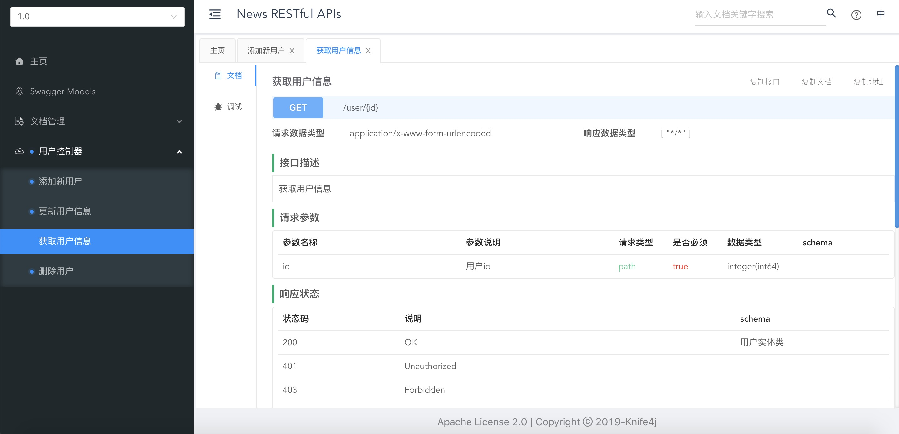

# Spring Boot整合Knife4j

## 介绍
knife4j是为Java MVC框架集成Swagger生成Api文档的增强解决方案,有着一套全新的UI设计以及更强大的功能。

## 简单上手knife4j

1. 引入knife4j引用
```XML
<dependency>
    <groupId>com.github.xiaoymin</groupId>
    <artifactId>knife4j-spring-boot-starter</artifactId>
    <version>2.0.4</version>
</dependency>
<!-- 避免版本冲突 -->
<dependency>
    <groupId>com.google.guava</groupId>
    <artifactId>guava</artifactId>
    <version>29.0-jre</version>
</dependency>
```
> 注：knife4j集成到Spring Boot 2.3.x版本启动时会抛出异常，需要指定`guava`包版本为最高的**29.0-jre**，解决包版本冲突问题以后即可

2. 添加knife4j配置类
```JAVA
@Configuration
@EnableSwagger2 // 开始Swagger功能
@EnableKnife4j // 开始knife4j增强功能
@Import(BeanValidatorPluginsConfiguration.class)
public class SwaggerConfiguration {

    @Bean(value = "defaultApi")
    public Docket defaultApi2() {
        Docket docket = new Docket(DocumentationType.SWAGGER_2)
                .apiInfo(apiInfo())
                //分组名称
                .groupName("1.0")
                .select()
                //这里指定Controller扫描包路径
                .apis(RequestHandlerSelectors.basePackage("com.borg.news"))
                .paths(PathSelectors.any())
                .build();
        return docket;
    }

    private ApiInfo apiInfo() {
        return new ApiInfoBuilder()
                .title("News RESTful APIs")
                .description("# Borg news RESTful APIs")
                .termsOfServiceUrl("http://www.baidu.com/")
                .version("1.0")
                .build();
    }

}
```

3. 若有拦截器，最好配置下knife4j的请求路径为不拦截，避免拦截后出现问题
```JAVA
@Configuration
public class InterceptorConfig implements WebMvcConfigurer {

    @Override
    public void addInterceptors(InterceptorRegistry registry) {
        InterceptorRegistration ir = registry.addInterceptor(new ResponseResultInterceptor()).addPathPatterns("/**");

        // 不拦截路径
        List<String> excludePaths = new ArrayList();
        // 开放knife4j
        excludePaths.add("/login");
        excludePaths.add("/doc.html");
        excludePaths.add("/service-worker.js");
        excludePaths.add("/swagger-resources");
        ir.excludePathPatterns(excludePaths);
    }
}
```

4. 配好以后即可和使用Swagger2一样正常使用
* 控制器注解

@Api，整个类的注释
```JAVA
@Api(tags = "用户控制器")
```
@ApiOperation，方法上的注释
```JAVA
@ApiOperation(value = "获取用户信息", notes = "获取用户信息")
```
@ApiImplicitParams，参数列表的注释
```JAVA
@ApiImplicitParams({
    @ApiImplicitParam(dataType = "Long", name = "id", value = "用户id", required = true)
})
```
@ApiImplicitParam，每一个参数的注释
```JAVA
@ApiImplicitParam(name="id", value="用户id", dataType="Long", required = true)
```

* 实体类注解

@ApiModel，实体类的注解
```JAVA
@ApiModel(value = "用户实体类")
```
@ApiModelProperty，字段的注解
```JAVA
@ApiModelProperty(value = "昵称")
```

5. 最终效果图


## 参考资料
1. [SpringBoot中整合knife4j接口文档](https://blog.csdn.net/qq_40065776/article/details/107083757)