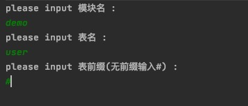
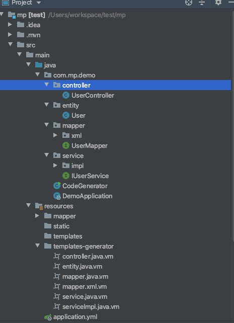

# Mybatis-Plus

## Mybatis-Plus 自动生成代码

1. 添加依赖
```XML
<!--        引入 Mybatis-Plus 启动器-->
<dependency>
    <groupId>com.baomidou</groupId>
    <artifactId>mybatis-plus-boot-starter</artifactId>
    <version>3.4.0</version>
</dependency>
<!--        引入 Mybatis-Plus 代码生成器-->
<dependency>
    <groupId>com.baomidou</groupId>
    <artifactId>mybatis-plus-generator</artifactId>
    <version>3.4.0</version>
</dependency>
<!--        引入 velocity 模板引擎-->
<dependency>
    <groupId>org.apache.velocity</groupId>
    <artifactId>velocity-engine-core</artifactId>
    <version>2.2</version>
</dependency>
```

2. 在 resources 目录下添加模板

  * **controller.java.vm**
  
  ```JAVA
  package ${package.Controller};


  import org.springframework.web.bind.annotation.RequestMapping;

  #if(${restControllerStyle})
  import org.springframework.web.bind.annotation.RestController;
  #else
  import org.springframework.stereotype.Controller;
  #end
  #if(${superControllerClassPackage})
  import ${superControllerClassPackage};
  #end

  /**
  * @auther ${author}
  * @create ${cfg.dateTime}
  * @describe $!{table.comment}前端控制器
  */
  #if(${restControllerStyle})
  @RestController
  #else
  @Controller
  #end
  @RequestMapping("#if(${package.ModuleName})/${package.ModuleName}#end/#if(${controllerMappingHyphenStyle})${controllerMappingHyphen}#else${table.entityPath}#end")
  #if(${kotlin})
  class ${table.controllerName}#if(${superControllerClass}) : ${superControllerClass}()#end

  #else
      #if(${superControllerClass})
      public class ${table.controllerName} extends ${superControllerClass} {
      #else
      public class ${table.controllerName} {
      #end

          }
  #end
  ```

  * **entity.java.vm**
  
  ```JAVA
  package ${package.Entity};

  #foreach($pkg in ${table.importPackages})
  import ${pkg};
  #end
  import com.baomidou.mybatisplus.annotation.*;
  #if(${swagger2})
  import io.swagger.annotations.ApiModel;
  import io.swagger.annotations.ApiModelProperty;
  import com.fasterxml.jackson.annotation.JsonInclude;
  #end
  #if(${entityLombokModel})
  import lombok.Data;
  #end

  /**
  * @auther ${author}
  * @create ${cfg.dateTime}
  * @describe $!{table.comment}实体类
  */
  #if(${entityLombokModel})
  @Data
  #end
  @TableName("${table.name}")
  #if(${swagger2})
  @JsonInclude(JsonInclude.Include.NON_NULL)
  @ApiModel(value="${entity}对象", description="$!{table.comment}")
  #end
  #if(${superEntityClass})
  public class ${entity} extends ${superEntityClass}#if(${activeRecord})<${entity}>#end {
  #elseif(${activeRecord})
  public class ${entity} extends Model<${entity}> {
  #else
  public class ${entity} implements Serializable {
  #end

  private static final long serialVersionUID = 1L;
  ## ---------- BEGIN 字段循环遍历 ----------
  #foreach($field in ${table.fields})

      #if(${field.keyFlag})
          #set($keyPropertyName=${field.propertyName})
      #end
      #if("$!field.comment" != "")
          #if(${swagger2})
          @ApiModelProperty(value = "${field.comment}")
          #else
          /**
          * ${field.comment}
          */
          #end
      #end
      #if(${field.keyFlag})
          ## 主键
          #if(${field.keyIdentityFlag})
          @TableId(value = "${field.name}", type = IdType.AUTO)
          #elseif(!$null.isNull(${idType}) && "$!idType" != "")
          @TableId(value = "${field.name}", type = IdType.${idType})
          #elseif(${field.convert})
          @TableId("${field.name}")
          #end
          ## 普通字段
      #elseif(${field.fill})
          ## -----  存在字段填充设置  -----
          #if(${field.convert})
          @TableField(value = "${field.name}", fill = FieldFill.${field.fill})
          #else
          @TableField(fill = FieldFill.${field.fill})
          #end
      #else
      @TableField("${field.name}")
      #end
      ## 乐观锁注解
      #if(${versionFieldName}==${field.name})
      @Version
      #end
      ## 逻辑删除注解
      #if(${logicDeleteFieldName}==${field.name})
      @TableLogic
      #end
  private ${field.propertyType} ${field.propertyName};
  #end
  ## ---------- END 字段循环遍历 ----------

  #if(!${entityLombokModel})
      #foreach($field in ${table.fields})
          #if(${field.propertyType.equals("boolean")})
              #set($getprefix="is")
          #else
              #set($getprefix="get")
          #end

      public ${field.propertyType} ${getprefix}${field.capitalName}() {
              return ${field.propertyName};
              }

          #if(${entityBuilderModel})
          public ${entity} set${field.capitalName}(${field.propertyType} ${field.propertyName}) {
          #else
          public void set${field.capitalName}(${field.propertyType} ${field.propertyName}) {
          #end
              this.${field.propertyName} = ${field.propertyName};
          #if(${entityBuilderModel})
                  return this;
          #end
              }
      #end
  #end

  #if(${entityColumnConstant})
      #foreach($field in ${table.fields})
      public static final String ${field.name.toUpperCase()} = "${field.name}";

      #end
  #end
  #if(${activeRecord})
  @Override
  protected Serializable pkVal() {
      #if(${keyPropertyName})
              return this.${keyPropertyName};
      #else
              return null;
      #end
          }

  #end
  #if(!${entityLombokModel})
  @Override
  public String toString() {
          return "${entity}{" +
      #foreach($field in ${table.fields})
          #if($!{foreach.index}==0)
                  "${field.propertyName}=" + ${field.propertyName} +
          #else
                  ", ${field.propertyName}=" + ${field.propertyName} +
          #end
      #end
          "}";
          }
  #end
          }
  ```

  * **mapper.java.vm**
  
  ```JAVA
  package ${package.Mapper};

  import ${package.Entity}.${entity};
  import ${superMapperClassPackage};

  /**
  * @auther ${author}
  * @create ${cfg.dateTime}
  * @describe $!{table.comment}mapper类
  */
  #if(${kotlin})
  interface ${table.mapperName} : ${superMapperClass}<${entity}>
  #else
  public interface ${table.mapperName} extends ${superMapperClass}<${entity}> {

          }
  #end
  ```

  * **mapper.xml.vm**
  
  ```JAVA
  <&#63;xml version="1.0" encoding="UTF-8"&#63;>
  <!DOCTYPE mapper PUBLIC "-//mybatis.org//DTD Mapper 3.0//EN" "http://mybatis.org/dtd/mybatis-3-mapper.dtd">
  <mapper namespace="${package.Mapper}.${table.mapperName}">

      #if(${enableCache})
          <!-- 开启二级缓存 -->
          <cache type="org.mybatis.caches.ehcache.LoggingEhcache"/>

      #end
      #if(${baseResultMap})
          <!-- 通用查询映射结果 -->
          <resultMap id="BaseResultMap" type="${package.Entity}.${entity}">
              #foreach($field in ${table.fields})
                  #if(${field.keyFlag})##生成主键排在第一位
                      <id column="${field.name}" property="${field.propertyName}" />
                  #end
              #end
              #foreach($field in ${table.commonFields})##生成公共字段
                  <result column="${field.name}" property="${field.propertyName}" />
              #end
              #foreach($field in ${table.fields})
                  #if(!${field.keyFlag})##生成普通字段
                      <result column="${field.name}" property="${field.propertyName}" />
                  #end
              #end
          </resultMap>

      #end
      #if(${baseColumnList})
          <!-- 通用查询结果列 -->
          <sql id="Base_Column_List">
              #foreach($field in ${table.commonFields})
                  ${field.name},
              #end
              ${table.fieldNames}
          </sql>

      #end
  </mapper>
  ```

  * **service.java.vm**
  
  ```JAVA
  package ${package.Service};

  import ${package.Entity}.${entity};
  import ${superServiceClassPackage};

  /**
  * @auther ${author}
  * @create ${cfg.dateTime}
  * @describe $!{table.comment}服务类
  */
  #if(${kotlin})
  interface ${table.serviceName} : ${superServiceClass}<${entity}>
  #else
  public interface ${table.serviceName} extends ${superServiceClass}<${entity}> {

          }
  #end
  ```

  * **serviceImpl.java.vm**
  
  ```JAVA
  package ${package.ServiceImpl};

  import ${package.Entity}.${entity};
  import ${package.Mapper}.${table.mapperName};
  import ${package.Service}.${table.serviceName};
  import ${superServiceImplClassPackage};
  import org.springframework.stereotype.Service;

  /**
  * @auther ${author}
  * @create ${cfg.dateTime}
  * @describe $!{table.comment}服务实现类
  */
  @Service
  #if(${kotlin})
  open class ${table.serviceImplName} : ${superServiceImplClass}<${table.mapperName}, ${entity}>(), ${table.serviceName} {

          }
  #else
          public class ${table.serviceImplName} extends ${superServiceImplClass}<${table.mapperName}, ${entity}> implements ${table.serviceName} {

          }
  #end
  ```

  3. 创建 `CodeGenerator.class` 类

  ```JAVA
  package com.mp.demo;

  import com.baomidou.mybatisplus.annotation.IdType;
  import com.baomidou.mybatisplus.core.exceptions.MybatisPlusException;
  import com.baomidou.mybatisplus.core.toolkit.StringPool;
  import com.baomidou.mybatisplus.core.toolkit.StringUtils;
  import com.baomidou.mybatisplus.generator.AutoGenerator;
  import com.baomidou.mybatisplus.generator.InjectionConfig;
  import com.baomidou.mybatisplus.generator.config.*;
  import com.baomidou.mybatisplus.generator.config.po.TableInfo;
  import com.baomidou.mybatisplus.generator.config.rules.DateType;
  import com.baomidou.mybatisplus.generator.config.rules.NamingStrategy;
  import com.sun.javafx.PlatformUtil;

  import java.time.LocalDateTime;
  import java.time.format.DateTimeFormatter;
  import java.util.*;

  public class CodeGenerator {
      /**
      * 代码生成位置
      */
      public static final String PARENT_NAME = "com.mp";

      /**
      * modular 名字
      */
      public static final String MODULAR_NAME = "";

      /**
      * 基本路径
      */
      public static final String SRC_MAIN_JAVA = "src/main/java/";

      /**
      * 作者
      */
      public static final String AUTHOR = "CodeGenerator";

      /**
      * 是否是 rest 接口
      */
      private static final boolean REST_CONTROLLER_STYLE = true;

      public static final String JDBC_MYSQL_URL = "jdbc:mysql://localhost:3306/example";

      public static final String JDBC_DRIVER_NAME = "com.mysql.cj.jdbc.Driver";

      public static final String JDBC_USERNAME = "root";

      public static final String JDBC_PASSWORD = "123456";

      public static void main(String[] args) {
          String moduleName = scanner("模块名");
          String tableName = scanner("表名");
          String tablePrefix = scanner("表前缀(无前缀输入#)").replaceAll("#", "");
          autoGenerator(moduleName, tableName, tablePrefix);
      }

      public static void autoGenerator(String moduleName, String tableName, String tablePrefix) {
          new AutoGenerator()
                  .setGlobalConfig(getGlobalConfig())
                  .setDataSource(getDataSourceConfig())
                  .setPackageInfo(getPackageConfig(moduleName))
                  .setStrategy(getStrategyConfig(tableName, tablePrefix))
                  .setCfg(getInjectionConfig(moduleName))
                  .setTemplate(getTemplateConfig())
                  .execute();
      }

      private static String getDateTime() {
          LocalDateTime localDate = LocalDateTime.now();
          DateTimeFormatter formatter = DateTimeFormatter.ofPattern("yyyy-MM-dd HH:mm:ss");
          return localDate.format(formatter);
      }

      private static InjectionConfig getInjectionConfig(final String moduleName) {
          return new InjectionConfig() {
              @Override
              public void initMap() {
                  Map map = new HashMap();
                  map.put("dateTime", getDateTime());
                  setMap(map);
                  final String projectPath = System.getProperty("user.dir");
                  List<FileOutConfig> fileOutConfigList = new ArrayList<FileOutConfig>();
                  // 自定义配置会被优先输出
                  fileOutConfigList.add(new FileOutConfig("/templates/mapper.xml.vm") {
                      @Override
                      public String outputFile(TableInfo tableInfo) {
                          // 自定义输出文件名，如果entity设置了前后缀，此次注意xml的名称也会跟着发生变化
                          return projectPath + "/src/main/resources/mapper/" +
                                  moduleName + "/" + tableInfo.getEntityName() + "Mapper" + StringPool.DOT_XML;
                      }
                  });
                  setFileOutConfigList(fileOutConfigList);
              }
          };
      }


      private static StrategyConfig getStrategyConfig(String tableName, String tablePrefix) {
          return new StrategyConfig()
                  .setNaming(NamingStrategy.underline_to_camel)
                  .setColumnNaming(NamingStrategy.underline_to_camel)
                  .setInclude(tableName)
                  .setRestControllerStyle(REST_CONTROLLER_STYLE)
  //                .setEntityBuilderModel(true)
                  .setControllerMappingHyphenStyle(true)
  //                .entityTableFieldAnnotationEnable(true)
                  .setTablePrefix(tablePrefix + "_");
      }

      private static PackageConfig getPackageConfig(String moduleName) {
          return new PackageConfig()
                  .setModuleName(moduleName)
                  .setParent(PARENT_NAME)
                  .setService("service")
                  .setServiceImpl("service.impl")
                  .setController("controller")
                  .setEntity("entity");
      }

      private static DataSourceConfig getDataSourceConfig() {
          return new DataSourceConfig()
                  .setUrl(JDBC_MYSQL_URL)
                  .setDriverName(JDBC_DRIVER_NAME)
                  .setUsername(JDBC_USERNAME)
                  .setPassword(JDBC_PASSWORD);
      }

      private static GlobalConfig getGlobalConfig() {
          String projectPath = System.getProperty("user.dir");
          String filePath = projectPath + "/" + MODULAR_NAME + SRC_MAIN_JAVA;
          if (PlatformUtil.isWindows()) {
              filePath = filePath.replaceAll("/+|\\\\+", "\\\\");
          } else {
              filePath = filePath.replaceAll("/+|\\\\+", "/");
          }
          return new GlobalConfig()
                  .setOutputDir(filePath)
                  .setDateType(DateType.ONLY_DATE)
                  .setIdType(IdType.UUID)
                  .setAuthor(AUTHOR)
                  .setBaseColumnList(true)
  //                .setSwagger2(true)
                  .setEnableCache(false)
                  .setBaseResultMap(true)
                  .setOpen(false);
      }

      private static TemplateConfig getTemplateConfig() {
          return new TemplateConfig()
                  .setController("/templates-generator/controller.java.vm")
                  .setService("/templates-generator/service.java.vm")
                  .setServiceImpl("/templates-generator/serviceImpl.java.vm")
                  .setEntity("/templates-generator/entity.java.vm")
                  .setMapper("/templates-generator/mapper.java.vm")
                  .setXml("/templates-generator/mapper.xml.vm");
      }

      private static String scanner(String tip) {
          Scanner scanner = new Scanner(System.in);
          StringBuilder sb = new StringBuilder();
          sb.append("please input " + tip + " : ");
          System.out.println(sb.toString());
          if (scanner.hasNext()) {
              String ipt = scanner.next();
              if (StringUtils.isNotBlank(ipt)) {
                  return ipt;
              }
          }
          throw new MybatisPlusException("please input the correct " + tip + ". ");
      }
  }
  ```

  4. 运行 `main` 函数

  

  5. 运行后项目目录结构

  

## 参考资料
1. [怎么用mybatis-plus-generator实现代码自动生成](https://www.yisu.com/zixun/228300.html)