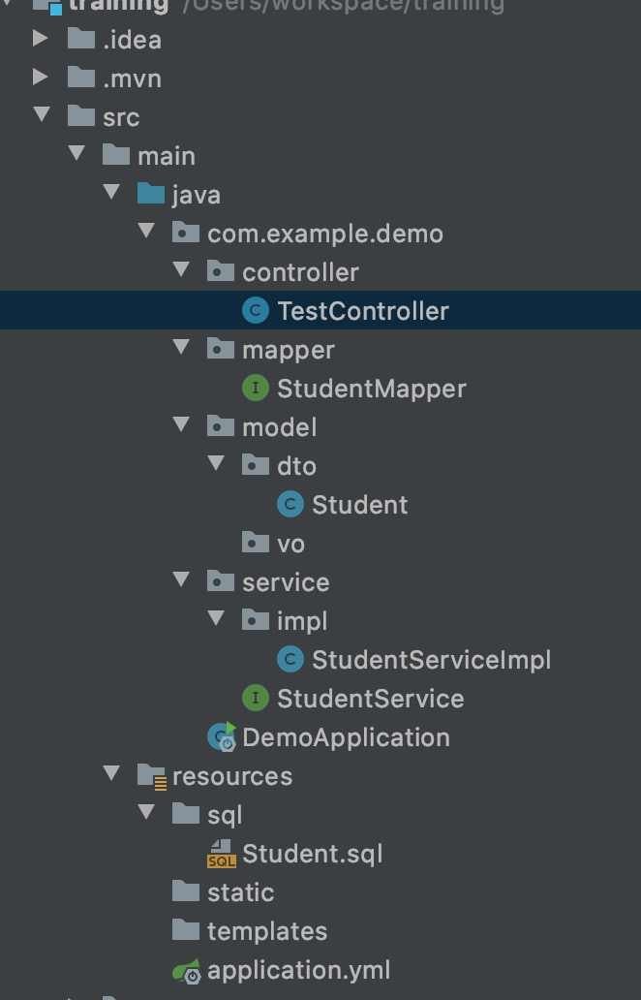
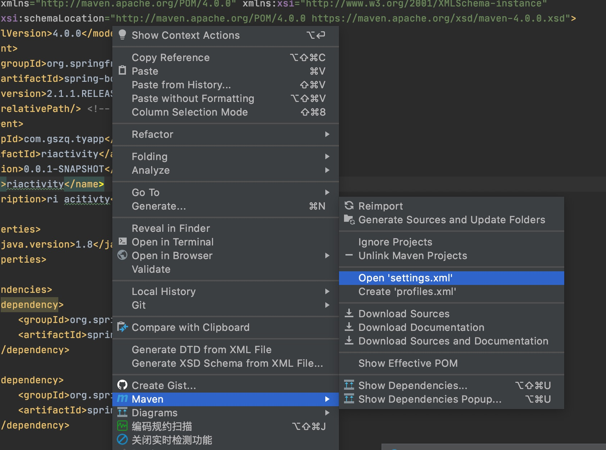

# Spring Boot 整合Mybatis与Druid

## 介绍
Mybatis是Java中常用的一个ORM框架，是一个操作简单，非常方便的框架。Druid是阿里的一个数据库连接池，同样操作非常简单，只需要在配置文件中写明配置即可。还提供了强大的监控和拓展功能。

## 整合

1. 添加*Mysql*，*Mybatis*，*Druid* 的Maven依赖
```XML
<dependency>
    <groupId>org.mybatis.spring.boot</groupId>
    <artifactId>mybatis-spring-boot-starter</artifactId>
    <version>2.1.3</version>
</dependency>

<dependency>
    <groupId>mysql</groupId>
    <artifactId>mysql-connector-java</artifactId>
    <scope>runtime</scope>
</dependency>

<dependency>
    <groupId>com.alibaba</groupId>
    <artifactId>druid-spring-boot-starter</artifactId>
    <version>1.1.10</version>
</dependency>
```

2. Druid数据源配置
```YAML
spring:
  datasource:
    # 数据库访问配置, 使用druid数据源
    type: com.alibaba.druid.pool.DruidDataSource
    driver-class-name: com.mysql.jdbc.Driver
    url: jdbc:mysql://localhost:3306/example
    username: root
    password: 123456

    druid:
      # 连接池配置
      initial-size: 5
      min-idle: 5
      max-active: 20
      # 连接等待超时时间
      max-wait: 30000
      # 配置检测可以关闭的空闲连接间隔时间
      time-between-eviction-runs-millis: 60000
      # 配置连接在池中的最小生存时间
      min-evictable-idle-time-millis: 300000
      validation-query: select '1' from dual
      test-while-idle: true
      test-on-borrow: false
      test-on-return: false
      # 打开PSCache，并且指定每个连接上PSCache的大小
      pool-prepared-statements: true
      max-open-prepared-statements: 20
      max-pool-prepared-statement-per-connection-size: 20
      # 配置监控统计拦截的filters, 去掉后监控界面sql无法统计, 'wall'用于防火墙
      filters: stat,wall
      # Spring监控AOP切入点，如x.y.z.service.*,配置多个英文逗号分隔
      aop-patterns: com.example.demo.service.*


      # WebStatFilter配置
      web-stat-filter:
        enabled: true
        # 添加过滤规则
        url-pattern: /*
        # 忽略过滤的格式
        exclusions: '*.js,*.gif,*.jpg,*.png,*.css,*.ico,/druid/*'

      # StatViewServlet配置
      stat-view-servlet:
        enabled: true
        # 访问路径为/druid时，跳转到StatViewServlet
        url-pattern: /druid/*
        # 是否能够重置数据
        reset-enable: false
        # 需要账号密码才能访问控制台
        login-username: root
        login-password: 123456
        # IP白名单
        # allow: 127.0.0.1
        #　IP黑名单（共同存在时，deny优先于allow）
        # deny: 192.168.1.218

      # 配置StatFilter
      filter:
        stat:
          log-slow-sql: true
```

3. 使用Mybatis

使用库表：
```SQL
CREATE TABLE student (
    SNO varchar(3) NOT NULL ,
    SNAME varchar(9) NOT NULL ,
    SSEX varchar(2) NOT NULL
);

INSERT INTO student VALUES ('001', 'KangKang', 'M ');
INSERT INTO student VALUES ('002', 'Mike', 'M ');
INSERT INTO student VALUES ('003', 'Jane', 'F ');
```

创建测试实体类
```JAVA
@Data
public class Student implements Serializable {
    private static final long serialVersionUID = -339516038496531943L;

    private String sno;
    private String name;
    private String sex;
}
```

创建Mapper，此处使用注解的方式定义SQL语句，还可以以XML的形式定义SQL，具体请参照资料
```JAVA
@Component
@Mapper
public interface StudentMapper {

    @Insert("insert into student(sno,sname,ssex) values(#{sno},#{name},#{sex})")
    int add(Student student);

    @Update("update student set sname=#{name},ssex=#{sex} where sno=#{sno}")
    int update(Student student);

    @Delete("delete from student where sno=#{sno}")
    int deleteBysno(String sno);

    @Select("select * from student where sno=#{sno}")
    @Results(id = "student",value= {
            @Result(property = "sno", column = "sno", javaType = String.class),
            @Result(property = "name", column = "sname", javaType = String.class),
            @Result(property = "sex", column = "ssex", javaType = String.class)
    })
    Student queryStudentBySno(String sno);
}
```

定义Service接口
```JAVA
public interface StudentService {

    int add(Student student);
    int update(Student student);
    int deleteBysno(String sno);
    Student queryStudentBySno(String sno);
}
```

实现Service
```JAVA
@Service("studentService")
public class StudentServiceImpl implements StudentService {
    @Autowired
    private StudentMapper studentMapper;

    @Override
    public int add(Student student) {
        return this.studentMapper.add(student);
    }

    @Override
    public int update(Student student) {
        return this.studentMapper.update(student);
    }

    @Override
    public int deleteBysno(String sno) {
        return this.studentMapper.deleteBysno(sno);
    }

    @Override
    public Student queryStudentBySno(String sno) {
        return this.studentMapper.queryStudentBySno(sno);
    }
}
```

实现Controller
```JAVA
@RestController
public class TestController {

    @Autowired
    private StudentService studentService;

    @RequestMapping( value = "/querystudent", method = RequestMethod.GET)
    public Student queryStudentBySno(String sno) {
        return this.studentService.queryStudentBySno(sno);
    }
}
```

项目结构图


启动项目访问：[http://localhost:8080/querystudent?sno=001](http://localhost:8080/web/querystudent?sno=001)

查询结果图


Druid管理控台图


## 问题总结
在实际操作的时候碰到了两个问题，记录下来，大家可以避免踩坑。

1. **Maven数据源配置错误，导致druid-spring-boot-starter导入不进来：** 开始的时候我Maven数据源配的不对，虽然也是阿里的，但是Druid Stater就是import不进来，在查询并且重新修改了*seetings.xml*以后，总算可以正常import依赖了，步骤如下：

打开*seetings.xml*文件


修改文件内容
```XML
<?xml version="1.0" encoding="UTF-8"?>
<settings xmlns="http://maven.apache.org/SETTINGS/1.0.0"
          xmlns:xsi="http://www.w3.org/2001/XMLSchema-instance"
          xsi:schemaLocation="http://maven.apache.org/SETTINGS/1.0.0 http://maven.apache.org/xsd/settings-1.0.0.xsd">
    <mirrors>
        <mirror>
            <id>nexus-aliyun</id>
            <mirrorOf>central</mirrorOf>
            <name>Nexus aliyun</name>
            <url>http://maven.aliyun.com/nexus/content/groups/public</url>
        </mirror>
    </mirrors>
</settings>
```

如上操作完即可。

2. **druid-spring-boot-starter版本过高导致Druid控台404访问不到：** 在开始的时候我使用的1.1.20的版本，可能是因为版本过高，与Mysql Driver不匹配，导致无法打开Druid控台，在修改版本以后即可。


## 参考文章
1. [Spring Boot中使用MyBatis](https://mrbird.cc/Spring-Boot%20Mybatis.html)
2. [Druid官方问题汇总，值得参考](https://github.com/alibaba/druid/wiki/%E5%B8%B8%E8%A7%81%E9%97%AE%E9%A2%98)
3. [Mybaits文档](https://mybatis.org/mybatis-3/zh/java-api.html)