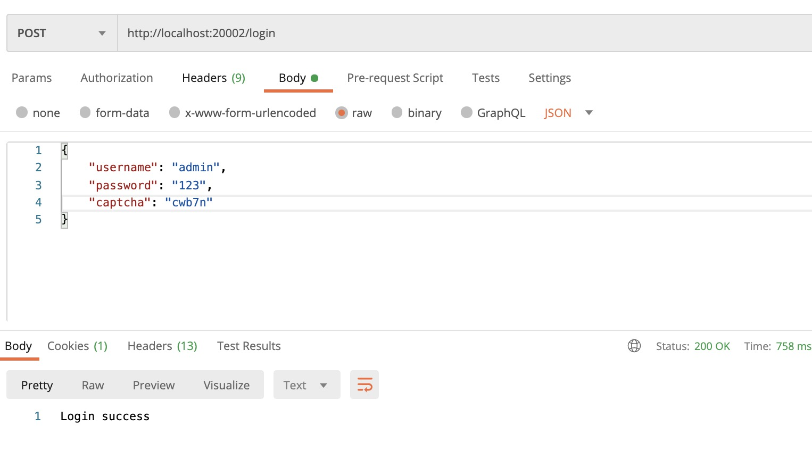
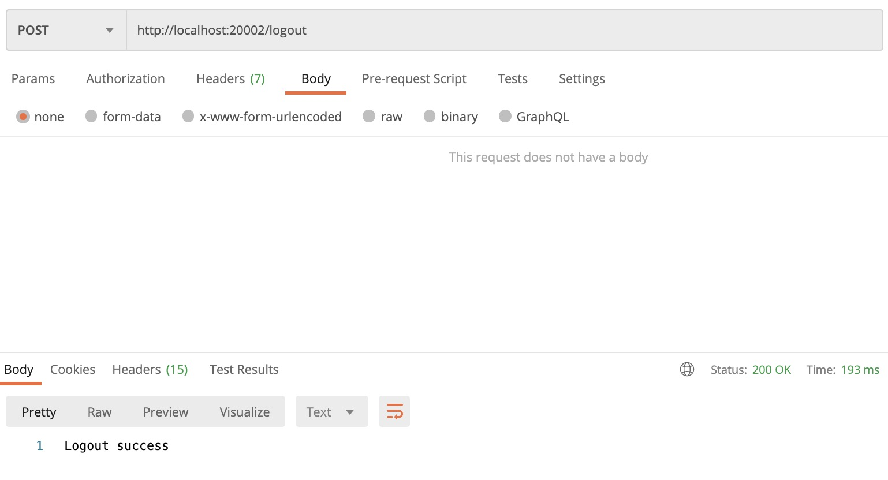

# 登录使用 body JSON 传参
之前的5个篇章基本上能完成一个登录模块，这篇我们介绍下如何在 body 中使用 JSON 来传参调用登录接口，后续还会再补充下登出逻辑。

## 1. 添加工具类
> 工具类中添加用于从 HttpServletRequest 中获取参数的方法

```JAVA
package com.example.security.utils;

import com.fasterxml.jackson.databind.ObjectMapper;
import lombok.extern.slf4j.Slf4j;
import org.apache.logging.log4j.util.Strings;

import javax.servlet.ServletInputStream;
import javax.servlet.http.HttpServletRequest;
import java.util.HashMap;
import java.util.Map;

@Slf4j
public class CommonUtil {

    private static final String PARSED_BODY_KEY = "PARSED_BODY";

    /**
     * 获取请求中的所有参数
     */
    public static final Map<String, Object> getBodyParametersFromRequest(HttpServletRequest request) {
        Map<String, Object> map = null;

        if (request != null) {
            // 优先从 request attribute 中读取参数
            map = (Map<String, Object>) request.getAttribute(PARSED_BODY_KEY);

            // 若从 request attribute 没有读取到参数则从 request 中读取，这样做是因为 request 的流只能读取一次
            if (map == null) {
                map = readParamsFromRequest(request);
                // 读取完以后存入 request attribute
                request.setAttribute(PARSED_BODY_KEY, map);
            }
        }

        if (map == null) {
            map = new HashMap<>(0);
        }

        return map;
    }

    /**
     * 获取请求中的指定字符串参数
     */
    public static final String getStringBodyParameterFromRequest(HttpServletRequest request, String key) {
        String result = Strings.EMPTY;
        Map<String, Object> map = getBodyParametersFromRequest(request);

        if (map.get(key) != null) {
            result = map.get(key).toString();
        }

        return result;
    }

    /**
     * 从请求中读取参数，转为 Map
     */
    private static Map<String, Object> readParamsFromRequest(HttpServletRequest request) {
        Map<String, Object> map = null;

        try {
            // 从 request 中读取 Body 数据
            ServletInputStream inputStream = request.getInputStream();
            StringBuilder content = new StringBuilder();
            byte[] b = new byte[1024];
            int lens;
            while ((lens = inputStream.read(b)) > 0) {
                content.append(new String(b, 0, lens));
            }

            // 将字符串转换为 Map 集合
            ObjectMapper mapper = new ObjectMapper();
            map = mapper.readValue(content.toString(), Map.class);
        } catch (Exception ex) {
            log.error("Error occurred while read params from request");
        }

        return map;
    }
}
```
## 2. 添加自定义用户名密码认证过滤器
> 继承 `UsernamePasswordAuthenticationFilter` 类，并复写 `attemptAuthentication` 方法，主动读取 body 中的参数。

```JAVA
package com.example.security.filter;

import com.example.security.utils.CommonUtil;
import org.springframework.http.MediaType;
import org.springframework.security.authentication.UsernamePasswordAuthenticationToken;
import org.springframework.security.core.Authentication;
import org.springframework.security.core.AuthenticationException;
import org.springframework.security.web.authentication.UsernamePasswordAuthenticationFilter;

import javax.servlet.http.HttpServletRequest;
import javax.servlet.http.HttpServletResponse;
import java.util.Map;

public class CustomAuthenticationFilter extends UsernamePasswordAuthenticationFilter {

    private static final String APPLICATION_JSON_UTF8_VALUE_WITH_SPACE = "application/json; charset=UTF-8";
    private static final String USERNAME = "username";
    private static final String PASSWORD = "password";

    @Override
    public Authentication attemptAuthentication(HttpServletRequest request, HttpServletResponse response) throws AuthenticationException {
        // 通过 ContentType 判断是否是 JSON 登录
        String contentType = request.getContentType();
        if (MediaType.APPLICATION_JSON_UTF8_VALUE.equalsIgnoreCase(contentType) ||
                APPLICATION_JSON_UTF8_VALUE_WITH_SPACE.equalsIgnoreCase(contentType) ||
                MediaType.APPLICATION_JSON_VALUE.equalsIgnoreCase(contentType)) {

            // 获取 body 参数 Map
            Map<String, String> obj = CommonUtil.getStringBodyParametersFromRequest(request);
            // 使用用户名密码构建 Token
            UsernamePasswordAuthenticationToken token = new UsernamePasswordAuthenticationToken(
                    obj.get(USERNAME), obj.get(PASSWORD));
            setDetails(request, token);

            return this.getAuthenticationManager().authenticate(token);
        } else {
            return super.attemptAuthentication(request, response);
        }
    }
}

```

## 3. 修改 SecurityConfig 中的登录配置
```JAVA
package com.example.security.config;

import com.example.security.filter.CustomAuthenticationFilter;
import com.example.security.filter.ValidateCaptchaFilter;
import com.example.security.handler.*;
import org.springframework.beans.factory.annotation.Autowired;
import org.springframework.context.annotation.Bean;
import org.springframework.context.annotation.Configuration;
import org.springframework.security.config.annotation.ObjectPostProcessor;
import org.springframework.security.config.annotation.web.builders.HttpSecurity;
import org.springframework.security.config.annotation.web.configuration.EnableWebSecurity;
import org.springframework.security.config.annotation.web.configuration.WebSecurityConfigurerAdapter;
import org.springframework.security.crypto.bcrypt.BCryptPasswordEncoder;
import org.springframework.security.crypto.password.PasswordEncoder;
import org.springframework.security.web.access.intercept.FilterSecurityInterceptor;
import org.springframework.security.web.authentication.UsernamePasswordAuthenticationFilter;

@Configuration
@EnableWebSecurity
public class SecurityConfig extends WebSecurityConfigurerAdapter {

    @Autowired
    LoginSuccessHandler successHandler;

    @Autowired
    LoginFailureHandler failureHandler;

    @Autowired
    ValidateCaptchaFilter validateCaptchaFilter;

    @Autowired
    FilterInvocationSecurityMetadataSourceHandler securityMetadataSourceHandler;

    @Autowired
    AccessDecisionHandler accessDecisionHandler;

    @Autowired
    AccessDeniedHandler accessDeniedHandler;

    @Autowired
    AuthenticationEntryPointExceptionHandler entryPointExceptionHandler;

    @Autowired
    LogoutSuccessHandler logoutSuccessHandler;

    @Override
    protected void configure(HttpSecurity http) throws Exception {
        // 禁用CSRF 开启跨域
        http.cors().and().csrf().disable();

        http.authorizeRequests()
                // 通过 withObjectPostProcessor 将我们的两个处理器添加进入验证流程
                .withObjectPostProcessor(new ObjectPostProcessor<FilterSecurityInterceptor>() {
                    @Override
                    public <O extends FilterSecurityInterceptor> O postProcess(O o) {
                        // 决策管理器
                        o.setAccessDecisionManager(accessDecisionHandler);
                        // 权限数据源
                        o.setSecurityMetadataSource(securityMetadataSourceHandler);
                        return o;
                    }
                })
                // 配置验证码接口不需要校验
                .antMatchers("/login/captcha").permitAll()
                // 其他请求都需要校验
                .anyRequest().authenticated()
            .and()
                // 添加异常处理器
                .exceptionHandling()
                .accessDeniedHandler(accessDeniedHandler)
                .authenticationEntryPoint(entryPointExceptionHandler);
//            更换登录配置方式
//            .and()
//                // 登录接口不需要校验
//                .formLogin().permitAll()
//                .successHandler(successHandler)
//                .failureHandler(failureHandler);

        // 在用户名密码校验过滤器之前添加上验证码校验过滤器
        http.addFilterBefore(validateCaptchaFilter, UsernamePasswordAuthenticationFilter.class);
    }

    /**
     * 登录配置，使用自定义的用户名密码验证过滤器
     */
    @Bean
    CustomAuthenticationFilter customAuthenticationFilter() throws Exception {
        CustomAuthenticationFilter filter = new CustomAuthenticationFilter();
        filter.setAuthenticationSuccessHandler(successHandler);
        filter.setAuthenticationFailureHandler(failureHandler);
        // 可自定义登录接口请求路径
        // filter.setFilterProcessesUrl("");
        filter.setAuthenticationManager(authenticationManagerBean());

        return filter;
    }

    /**
     * 使用 Spring Security 自带的密码加密器
     */
    @Bean
    public PasswordEncoder passwordEncoder() {
        return new BCryptPasswordEncoder();
    }
}
```

## 4. 修改验证码读取方式为 json body 读取
```JAVA
package com.example.security.filter;

import com.example.security.exception.ValidateCaptchaException;
import com.example.security.model.Captcha;
import com.example.security.utils.CommonUtil;
import org.springframework.beans.factory.annotation.Autowired;
import org.springframework.security.web.authentication.AuthenticationFailureHandler;
import org.springframework.stereotype.Component;
import org.springframework.util.StringUtils;
import org.springframework.web.bind.ServletRequestBindingException;
import org.springframework.web.context.request.ServletWebRequest;
import org.springframework.web.filter.OncePerRequestFilter;

import javax.servlet.FilterChain;
import javax.servlet.ServletException;
import javax.servlet.http.HttpServletRequest;
import javax.servlet.http.HttpServletResponse;
import javax.servlet.http.HttpSession;
import java.io.IOException;

@Component
public class ValidateCaptchaFilter extends OncePerRequestFilter {

    @Autowired
    private AuthenticationFailureHandler authenticationFailureHandler;

    @Autowired
    private HttpSession session;

    /**
     * 静态字段可以添加至单独的静态字段文件中
     */
    private static final String LOGIN_PATH = "/login";
    private static final String POST_METHOD = "post";
    private static final String CAPTCHA_IS_EMPTY = "Captcha is empty";
    private static final String CAPTCHA_NOT_EXISTED = "Captcha not existed";
    private static final String CAPTCHA_IS_EXPIRED = "Captcha is expired";
    private static final String CAPTCHA_NOT_MATCHED = "Captcha not matched";
    private static final String CAPTCHA = "captcha";
    private static final String SESSION_KEY_CAPTCHA = "SESSION_KEY_CAPTCHA";

    @Override
    protected void doFilterInternal(HttpServletRequest httpServletRequest, HttpServletResponse httpServletResponse,
                                    FilterChain filterChain) throws ServletException, IOException {

        // 判断是否为请求登录接口，校验验证码
        if (LOGIN_PATH.equalsIgnoreCase(httpServletRequest.getRequestURI())
                && POST_METHOD.equalsIgnoreCase(httpServletRequest.getMethod())) {
            try {
                validateCode(new ServletWebRequest(httpServletRequest));
            } catch (ValidateCaptchaException e) {
                authenticationFailureHandler.onAuthenticationFailure(httpServletRequest, httpServletResponse, e);
                return;
            }
        }
        filterChain.doFilter(httpServletRequest, httpServletResponse);
    }
    private void validateCode(ServletWebRequest servletWebRequest) {
        Captcha codeInSession = (Captcha) session.getAttribute(SESSION_KEY_CAPTCHA);
        // 修改为从 body 中的 JSON 读取出验证码
        String codeInRequest = CommonUtil.getStringBodyParameterFromRequest(servletWebRequest.getRequest(), CAPTCHA);

        if (StringUtils.isEmpty(codeInRequest)) {
            throw new ValidateCaptchaException(CAPTCHA_IS_EMPTY);
        }
        if (codeInSession == null) {
            throw new ValidateCaptchaException(CAPTCHA_NOT_EXISTED);
        }
        if (codeInSession.isExpire()) {
            session.removeAttribute(SESSION_KEY_CAPTCHA);
            throw new ValidateCaptchaException(CAPTCHA_IS_EXPIRED);
        }
        if (!codeInSession.getCode().equalsIgnoreCase(codeInRequest)) {
            throw new ValidateCaptchaException(CAPTCHA_NOT_MATCHED);
        }

        session.removeAttribute(SESSION_KEY_CAPTCHA);
    }
}
```

## 5. 添加登出处理成功处理器
```JAVA
package com.example.security.handler;

import org.springframework.security.core.Authentication;

import javax.servlet.http.HttpServletRequest;
import javax.servlet.http.HttpServletResponse;
import java.io.IOException;

@Component
public class LogoutSuccessHandler implements org.springframework.security.web.authentication.logout.LogoutSuccessHandler {

    @Override
    public void onLogoutSuccess(HttpServletRequest httpServletRequest, HttpServletResponse httpServletResponse,
                                Authentication authentication) throws IOException {

        httpServletResponse.getWriter().write("Logout success");
    }
}
```

## 6. 在 SecurityConfig 中添加登出配置
```JAVA
package com.example.security.config;

import com.example.security.filter.CustomAuthenticationFilter;
import com.example.security.filter.ValidateCaptchaFilter;
import com.example.security.handler.*;
import org.springframework.beans.factory.annotation.Autowired;
import org.springframework.context.annotation.Bean;
import org.springframework.context.annotation.Configuration;
import org.springframework.security.config.annotation.ObjectPostProcessor;
import org.springframework.security.config.annotation.web.builders.HttpSecurity;
import org.springframework.security.config.annotation.web.configuration.EnableWebSecurity;
import org.springframework.security.config.annotation.web.configuration.WebSecurityConfigurerAdapter;
import org.springframework.security.crypto.bcrypt.BCryptPasswordEncoder;
import org.springframework.security.crypto.password.PasswordEncoder;
import org.springframework.security.web.access.intercept.FilterSecurityInterceptor;
import org.springframework.security.web.authentication.UsernamePasswordAuthenticationFilter;

@Configuration
@EnableWebSecurity
public class SecurityConfig extends WebSecurityConfigurerAdapter {

    @Autowired
    LoginSuccessHandler successHandler;

    @Autowired
    LoginFailureHandler failureHandler;

    @Autowired
    ValidateCaptchaFilter validateCaptchaFilter;

    @Autowired
    FilterInvocationSecurityMetadataSourceHandler securityMetadataSourceHandler;

    @Autowired
    AccessDecisionHandler accessDecisionHandler;

    @Autowired
    AccessDeniedHandler accessDeniedHandler;

    @Autowired
    AuthenticationEntryPointExceptionHandler entryPointExceptionHandler;

    @Autowired
    LogoutSuccessHandler logoutSuccessHandler;

    @Override
    protected void configure(HttpSecurity http) throws Exception {
        // 禁用CSRF 开启跨域
        http.cors().and().csrf().disable();

        http.authorizeRequests()
                // 通过 withObjectPostProcessor 将我们的两个处理器添加进入验证流程
                .withObjectPostProcessor(new ObjectPostProcessor<FilterSecurityInterceptor>() {
                    @Override
                    public <O extends FilterSecurityInterceptor> O postProcess(O o) {
                        // 决策管理器
                        o.setAccessDecisionManager(accessDecisionHandler);
                        // 权限数据源
                        o.setSecurityMetadataSource(securityMetadataSourceHandler);
                        return o;
                    }
                })
                // 配置验证码接口不需要校验
                .antMatchers("/login/captcha").permitAll()
                // 其他请求都需要校验
                .anyRequest().authenticated()
            .and()
                // 添加异常处理器
                .exceptionHandling()
                .accessDeniedHandler(accessDeniedHandler)
                .authenticationEntryPoint(entryPointExceptionHandler)
            .and()
                // 登出配置
                .logout()
                .permitAll()
                // 可以配置不同的登出接口请求地址
                // .logoutUrl()
                .logoutSuccessHandler(logoutSuccessHandler)
                // 登出之后删除cookie
                .deleteCookies("JSESSIONID");

        // 在用户名密码校验过滤器之前添加上验证码校验过滤器
        http.addFilterBefore(validateCaptchaFilter, UsernamePasswordAuthenticationFilter.class);
    }

    /**
     * 登录配置，使用自定义的用户名密码验证过滤器
     */
    @Bean
    CustomAuthenticationFilter customAuthenticationFilter() throws Exception {
        CustomAuthenticationFilter filter = new CustomAuthenticationFilter();
        filter.setAuthenticationSuccessHandler(successHandler);
        filter.setAuthenticationFailureHandler(failureHandler);
        // 可自定义登录接口请求路径
        // filter.setFilterProcessesUrl("");
        filter.setAuthenticationManager(authenticationManagerBean());

        return filter;
    }

    /**
     * 使用 Spring Security 自带的密码加密器
     */
    @Bean
    public PasswordEncoder passwordEncoder() {
        return new BCryptPasswordEncoder();
    }
}
```

## 7. 测试

* 使用 JSON body 传参登录


* 登出



## 总结
使用 body JSON 传参的主要点在于使用**自定义的用户登录认证过滤器**，在自定义逻辑里面可以读取 request 中的 body 参数，处理起来也很简单。

需要注意的点是因为我们使用了验证码，需要同时将验证码也改为从 body JSON 中获取。这个时候就需要读取两次 request 中的参数，但是 request 中的可读流只能读取一次，不能将读取的位置回归起点，所以我们需要将参数存储在 request attributes 中，以便于可以多次读取参数。

登出逻辑的处理与登录逻辑比较相似，需要注意的是要记得在登出的时候清理掉 Cookies 中的 session id。